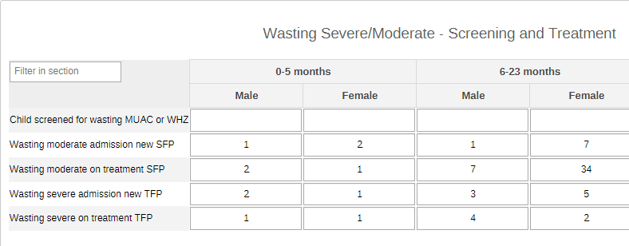

# Nutrition - System Design Document { #nutr-agg-design }

## Background and Purpose

The **Nutrition (NUT)** digital data package was developed in collaboration with UNICEF as a response to an expressed need from countries to rapidly adapt a solution for managing the data originating from the planned/undertaken nutrition activities. The NUT aggregate metadata package has therefore been designed as an installable solution for countries to update their DHIS2-based HMIS according to the updated version of the [UNICEF guidelines](https://data.unicef.org/resources/strengthening-nutrition-information-systems/).

This NUT Aggregate System Design document provides an overview of the design principles and global technical guidance used to develop a standard metadata package for monitoring the NUT activities at facility and community levels. The NUT metadata package can be adapted to local needs and national guidelines.

This document is intended for use by DHIS2 implementers at country and regional level to be able to support implementation and localization of the configuration package while adhering to the design principles set forth.

### Use Case

The NUT package has been designed for the data collection and analysis of routine nutrition activities carried out in the facilities as much as in the community.

It is recommended that the NUT datasets (facility and community) get assigned to Organisation Units at the lowest level of the health system feasible for reporting data.

The population dataset should instead be assigned according to the local level of aggregation of population data.

How and where to obtain the denominator related to the estimated population of children with moderate and severe wasting, as much as at what level the denominator is actioned, is very much dependent on the local context. Countries should therefore assign the dataset to the appropriate administrative level in the system's hierarchy in order to best mirror the local flow of information.

### Intended Users

- **Health facility users** and **community health providers**: capture and report key data on NUT activities presenting at the health facility and community levels
- **Program managers**: managers at national and sub-national level may be responsible for supporting data entry and analysis.
- **National and local health authorities**: to monitor and analyse the surveillance of data through dashboards and analytics tools, to conduct risk assessments and plan response measures; to generate reports for regional and global reporting

## System Design Overview

### Package Structure

The NUT aggregate package is structured as follows:

|        Data Set       | Periodicity |                                                                                         Description                                                                                            |
|---------|-----------|---------|
| **Nutrition VAS Event**  | Six-monthly | Vitamin A supplement activities linked to a one-time mass event happening once every half year either at community or facility levels.                                                     |
| **Nutrition Community**  | Monthly     | Reports the NUT activities (Micronutrient supplementation / Infant and Young Child Feeding / Maternal counselling / Growth Monitoring & Promotion and Wasting) occurring in the community with HCWs. |
| **Nutrition Facility**   | Monthly     | Reports the NUT activities  (Micronutrient supplementation / Infant and Young Child Feeding / Maternal counselling / Growth Monitoring & Promotion and Wasting) occurring at health facility level.  |
| **Nutrition Population** | Yearly      | Brief collection of basic demographic data points.                                                                                                                                         |
### Data Elements

The full list of data elements is available in the [Metadata Reference File](resources/NUTR00_1.0.0_DHIS2.37.xlsx)

>**NOTE:**
>
>Please note, that the DE groups have been named after the NUT activities rather than after the datasets - i.e. datasets may contain DEs that belong to several DEGs. Moreover, some DEs may be shared between datasets.

## Dataset Details

### Nutrition VAS Event Dataset Details

This dataset collects data on Vitamin A supplementation activities in both facility and community. Vitamin A supplementation is measured over a half year period, either via routine or campaigns (known as Events) or a mixture of both. This is defined as a semester. In analysis, specifically for indicator calculations, data must only be read as either a 6 month semester or a monthly value. Do not try to use the semester coverage to estimate a yearly coverage, the denominator is not the same as for a semester. GAVA (Global Alliance for Vitamin A supplementation) demands that the 2 values for each half year period are noted and the LOWER of the two values is used to reflect the coverage for the year. It is not possible to automatically calculate this in DHIS2 at present.

The section, and dataset, collects the information relative to the one-shot (event) distribution activities of Vitamin A and the supplements distributed to children and those distributed by CHWs. As Vitamin A is often distributed at health facilities during campaigns, the two data elements have been specifically designed to separate WHO distributed the supplements: nurses/doctors/pharmacists vs community health workers.

### Nutrition Community Dataset

The section focuses on antenatal contacts and new mothers receiving iron-containing supplements at community level.

The table considers children under 24 months visited at community level and the counselling consultations that have been given to their caregivers/mothers.
The second part of the table focuses on the antenatal contacts counselled on breastfeeding during the usual ANC contacts at community level.

The section focuses on counseling sessions given to mothers on uniquely the health of the mother to be/new mother herself during ANC and PNC in the community.

The section groups the routine screening performed on children during nutrition-related consultations (MUAC measurements, height/length and weight measurements) by age groups and sex. It also provides an aggregate overview of children who have lost or gained weight, or whose weight remained unchanged since the last contact. Finally, the section also reports the children with moderate and severe wasting referred for further evaluation and care.

The second part of the section summarizes the births occurring in the community and the weights of the newborns.

### Nutrition Facility Dataset

The section collects the information on routine administration of Vit A supplements to U5 children 6-59 months at facility level.

The section collects the data on Hb screenings and anaemia during ANC activities, and iron-containing supplementation during ANC and PNC visits at facility level.

### Infant and Young Child Feeding (IYCF)

The table considers the children under 24 months visited in the facilities and the counselling consultations that have been given to their caregivers/mothers.
The second part of the table focuses on pregnant mothers counseled on breastfeeding during the usual ANC contacts in facility.

The section focuses on counseling sessions given to mothers on uniquely the health of the mother to be/new mother herself during ANC and PNC at facility level.

The section gathers all the DEs related to the nutritional screenings (weight fluctuations, MUAC measurements, referrals for moderate and severe wasting, etc) of the children presenting at facility level.

The second part of the section summarizes the births occurring in the facility and the key information on birth weights of the newborns.

The section collects the information on children with wasting (severe or moderate by age groups and sex) and their admissions to feeding programs.

> **NOTE**
>
> It has not been included in the core configuration for version 1.0.0., but the section could be further disaggregated **by admission criteria** (admission by MUAC and admission by WHZ) if needed.

This section reports on referral of children with severe wasting that are referred to a hospital. This referral usually occurs due to medical complications

### Nutrition Population Dataset

The dataset collects very basic demographic data for the calculation of population-based prevalence within the NUT activities.
As aforementioned, the source of the denominators and assignation of the dataset to the admin level is very much dependent on the local context and should therefore be kept into consideration during the implementation of the package.

## Validation Rules

Validation rules have also been grouped by activity rather than datasets. All rules have been set with a monthly periodicity. The VR group is called NUT - Nutrition.
The full list of validation rules is available in the [Metadata Reference File](resources/NUTR00_1.0.0_DHIS2.37.xlsx).

## User Groups

As part of the package configuration, user groups have been created to be used to manage sharing settings in the metadata for all the modules. Core metadata that use these sharing settings include mainly the dataSets, dashboard, indicators and data Elements. The 3 user groups created include:

1. **NUT admin** - users in this group will have sharing setting with view/edit access metadata and view only access to data values in dataSets
2. **NUT access** - users in this group will have sharing setting with view only access to metadata and data values in dataSets  
3. **NUT data capture** - users in this group will have sharing setting with view only access to metadata and edit access to data values in dataSets

Whereas it is important to maintain these userGroups while installing this package, feel free to review them inline with any existing userGroups setup or policy in the host instance.

## Analytics and Indicators

Just like the data element groups, the indicators groups are divided by activities rather than by datasets. Moreover, the indicator groups are further divided by **“core”** and **“additional”** to indicate whether the indicators are part of the compulsory set of indicators, or whether the indicators are optional:

- Maternal Counselling *(Core)*
- Vitamin A supplement *(Core)*
- Wasting - Severe/Moderate *(Core)*
- Iron Supplement *(Core)*/Iron Supplement *(Additional)*
- Infant and Young Child Feeding *(Core)*/Infant and Young Child Feeding *(Additional)*
- Growth monitoring and promotion *(Core)*/Growth monitoring and promotion *(Additional)*

The full list of indicators is available in the [Metadata Reference File](resources/NUTR00_1.0.0_DHIS2.37.xlsx).

## Dashboards

The NUT package includes three predefined dashboard:

1. NUT - Community

2. NUT - Facility

3. NUT - Facility and Community

> **NOTE**
>
> Please note that the dashboards are preconfigured to provide the users a baseline onto which to build the local dashboards. Users >can edit (remove and add) items and their configuration - change the visualization depending on the disaggregations used, change the >time of analysis depending on the chosen periodicity of the datasets, or change the types of graphs just to name a few examples.

### Community Dashboard

This dashboard provides an example of a monitoring dashboard for community-based nutritional activities. Countries should adapt and expand it according to the local changes to the dataset.

The following table summarizes the items proposed in the dashboard:

| Item name    | Title                                                                                                         | Item type |
|--------------|---------------------------------------------------------------------------------------------------------------|----------|
| NUT_COMM_001 | NUT - Vitamin A 6-59 months routine in community, last semester                                               | maps     |
| NUT_COMM_002 | NUT - Child MUAC, weight and height assessment in community, last 6 months                                    | chart    |
| NUT_COMM_003 | NUT - PNC maternal, nutrition and diet counselling in community, last 6 months                                | chart    |
| NUT_COMM_004 | NUT - ANC maternal, nutrition and diet counselling in community, last 6 months                                | chart    |
| NUT_COMM_005 | NUT - Vitamin A supplement 6-59 months routine by CHW, last 4 semesters                                       | table    |
| NUT_COMM_006 | NUT - Vitamin A 6-59 months event in community, last semester                                                 | maps     |
| NUT_COMM_007 | NUT - ANC and PNC given iron containing supplement in community (%), last quarter                             | chart    |
| NUT_COMM_008 | NUT - PNC and ANC clients given iron containing supplement in community (%), last 6 months                    | chart    |
| NUT_COMM_009 | NUT - ANC breastfeeding counselling in community (%), last 6 months                                           | chart    |
| NUT_COMM_010 | NUT - Child consultation with counselling on appropriate complementary child feeding 6-23m (%), last 6 months | chart    |

### Facility Dashboard

This dashboard provides an example of a monitoring dashboard for facility-based nutritional activities. Countries should adapt and expand it according to the local changes to the dataset.

The following table summarizes the items proposed in the dashboard:

| Item name        | Title                                                                                     | Item type |
|------------------|-------------------------------------------------------------------------------------------|----------|
| NUT_FACILITY_001 | NUT - Vitamin A  supplementation Routine & Event per semester - last 2 semesters          | chart    |
| NUT_FACILITY_002 | NUT - Vitamin A supplement Coverage 6-59 months - last 2 semester by event               | chart    |
| NUT_FACILITY_003 | NUT - Receipt of iron containing supplements antenatal care contacts (%) Last 12 months   | chart    |
| NUT_FACILITY_004 | NUT - Antenatal client with iron supplement (%) last 3 months per district                | chart    |
| NUT_FACILITY_005 | NUT - Moderate wasting outcomes (%), last 6 months                                        | chart    |
| NUT_FACILITY_006 | NUT - Wasting - average length of stay by district, last quarter                          | chart    |
| NUT_FACILITY_007 | NUT - Wasting severe: Admissions by Age and Gender - last quarter                         | chart    |
| NUT_FACILITY_008 | NUT - Severe wasting outcomes (%), last 6 months                                          | chart    |
| NUT_FACILITY_009 | NUT - Wasting mortality (%), last 6 months                                                | chart    |
| NUT_FACILITY_010 | NUT - Wasting moderate treatment coverage (%), this year                                  | maps     |
| NUT_FACILITY_011 | NUT - Weight gain, physical activity and IFA counselling, last 6 months                  | chart    |
| NUT_FACILITY_012 | NUT - Vitamin A coverage 6-59 months event, last semester                                | maps     |
| NUT_FACILITY_013 | NUT - Vitamin A coverage 6-59 months routine, last semester                              | chart    |
| NUT_FACILITY_014 | NUT - Vitamin A supplement 6-59 months routine and events, last 4 semesters              | table    |
| NUT_FACILITY_015 | NUT - Vitamin A 6-11 M Supplementation coverage cumulative (semester)                     | chart    |
| NUT_FACILITY_016 | NUT - Child Growth Assessment (%) last 12 months                                          | chart    |
| NUT_FACILITY_017 | NUT - Child  MUAC, weight and height assessment, last 6 months                            | chart    |
| NUT_FACILITY_018 | NUT - PNC maternal, nutrition and diet counselling, last 6 months                        | chart    |
| NUT_FACILITY_019 | NUT - ANC maternal, nutrition and diet counselling, last 6 months                        | chart    |
| NUT_FACILITY_020 | NUT - Vitamin A coverage 6-59 months events, last semester                               | maps     |
| NUT_FACILITY_021 | NUT - Vitamin A cumulative coverage - all age groups                                      | chart    |
| NUT_FACILITY_022 | NUT - Child curative care appropriate recuperative feeding counselling (%), last 6 months | chart    |
| NUT_FACILITY_023 | NUT - Vitamin A coverage 6-59 months event, last semester                                 | maps     |
| NUT_FACILITY_024 | NUT - PNC given iron containing supplement (%), last 6 months                            | chart    |
| NUT_FACILITY_025 | NUT - Hemoglobin testing at first antenatal care contact (%)                              | maps     |
| NUT_FACILITY_026 | NUT - ANC breastfeeding counselling (%), last 6 months                                    | chart    |
| NUT_FACILITY_027 | NUT - Child consultation with counselling on appropriate feeding (%) , last 6  months    | chart    |
| NUT_FACILITY_028 | NUT - Child consultation with counselling on healthy eating 6-23 months (%), this year   | chart    |
| NUT_FACILITY_029 | NUT - First ANC contact - HB/Anaemia/iron supplement, last 6 months                        | chart    |
| NUT_FACILITY_030 | NUT - Wasting severe treatment coverage (%), this year                                    | maps     |

### Facility and Community Dashboard

This dashboard is a combination of data coming from facility-based activities and activities carried out in the community. Numbers need of course to be interpreted as totals for the specific activities (contacts) and not by person/client in order not to double count and skew the outcomes of the nutritional activities.

The following table summarizes the items proposed in the dashboard:

| Item name         | Title                                                                                               | Item type |
|-------------------|-----------------------------------------------------------------------------------------------------|----------|
| NUT_FAC_COMM_001 | NUT - Iron supplements for ANC/PNC for facility and community - last 4 quarters                     | chart    |
| NUT_FAC_COMM_002 | NUT - Weight measurement in facility and community, last 6 months                                   | chart    |
| NUT_FAC_COMM_003 | NUT - Height measurement in facility and community, last 6 months                                   | chart    |
| NUT_FAC_COMM_004 | NUT - MAUC measurement in facility and community, last quarter                                      | chart    |
| NUT_FAC_COMM_005 | NUT - ANC given healthy diet counselling in facility and community, last 6 months                   | chart    |
| NUT_FAC_COMM_006 | NUT - ANC given IFA counselling in facility and community, last quarter                             | chart    |
| NUT_FAC_COMM_007 | NUT - ANC given weight gain counselling in facility and community, last 6 months                    | chart    |
| NUT_FAC_COMM_008 | NUT - ANC  physical activity counselling in facility and community, last quarter                    | chart    |
| NUT_FAC_COMM_009 | NUT - ANC maternal counselling in facility and community, last 6 months                             | chart    |
| NUT_FAC_COMM_010 | NUT - Vitamin A  supplement 6-59 months routine and events facility and community, last 4 semesters | table    |
| NUT_FAC_COMM_011 | NUT - ANC all given iron containing supplement in facility and community (%), last 6 months         | chart    |
| NUT_FAC_COMM_012 | NUT - PNC all given iron containing supplement in facility and community (%), last quarter          | chart    |
| NUT_FAC_COMM_013 | NUT - IYCF counselling 6-23 months facility and community (%), last quarter                         | chart    |
| NUT_FAC_COMM_014 | NUT - IYCF counselling 0-5 months facility and community (%), last quarter                          | chart    |
| NUT_FAC_COMM_015 | NUT - ANC  breastfeeding counselling community and facility (%), last 6 months                      | chart    |
| NUT_FAC_COMM_016 | NUT - ANC maternal nutrition counselling in facility and community, last quarter                    | chart    |

## Special Considerations: Nutrition and Community

The need to align the efforts to enhance community programmes and their data is one of the paramount priorities for the effective analysis of community needs and activities.
While the Community dataset of the NUT package supports the collection of nutrition-related data at community level, the DHIS2 [**Community Health Information Systems (CHIS)**](#chis-system-design) metadata package is also designed to facilitate the capture and analysis of a core set of indicators for community-based health services. The CHIS metadata package developed in collaboration with UNICEF accompanies the  WHO Analysis and Use of Community Data: Guidance for community health service monitoring.
Among the range of health areas covered in the modules of the CHIS package, [**Nutrition information**](#ch-nut-aggregate-design) can be collected at monthly and yearly intervals.

Should users have **both the NUT and the CHIS packages** in the same instance, they can use the table to compare the two packages and observe the parallelisms and the differences in order to select the dataset that better mirrors the local activities.

The [NUT/CHIS summary table](resources/nut-chis-mapping.xlsx)  provides an overview of the alignment of the DEs present in the NUT - Community and in the CHIS - Nutrition datasets.

The following sections and DEs **in the NUT package have no direct overlap with the CHIS - Nutrition** dataset:

|  Section      |     DEs - Form name    |
|----------|-----------|
| Maternal counselling                  | ANC given maternal counselling ANC given maternal nutrition counselling in community ANC given health diet counselling ANC given weight gain counselling ANC given physical activity counselling ANC given IFA or iron containing supplement counselling PNC given maternal counselling PNC given maternal nutrition counselling PNC given healthy diet counselling |
| Infant and Young Child Feeding (IYCF) | PNC contacts - all                                                                                                                                                                                                                                                                                                                                                  |
| Growth monitoring and promotion       | Child weight lost Child weight unchanged Child gained weight Child referred for moderate wasting support to health facility by CHW                                                                                                                                                                                                                                  |

Some of the CHIS sections and DEs also do not directly overlap with any of the DEs in the NUT - Community dataset:

| Data set |  Section   |     DEs - Form name   |
|-------|--------------|-------|
| Monthly | Breastfeeding and birth weight         | Newborns delivered in the community and put to breast within the first hour of birth Newborns with documented birth weight Newborns with low birth weight delivered                                                       |
| Monthly | Deworming                              | People targeted for deworming preventive chemotherapy People receiving deworming preventive chemotherapy People receiving deworming preventive chemotherapy                                                               |
| Monthly | Vitamin A supplementation - events     | Children (6-59m) attending Vit A event in semester 1 Children (6-59m) given Vit A by CHW in semester 1 event Children (6-59m) attending Vit A event in semester 2 Children (6-59m) given Vit A by CHW in semester 2 event |
| Monthly | Severe Acute Malnutrition (SAM)        | Children (6-59m) assessed for SAM Children (6-59m) with SAM                                                                                                                                                               |
| Monthly | Wasting                                | Children (6-59m) in the community                                                                                                                                                                                         |
| Monthly | Diarrhoea                              | Children aged 0-9 years presenting with diarrhoea who received treatment Children (0-9 y) treated for diarrhoea                                                                                                           |
| Yearly  | Body weight                            | Children (5-19 y) overweight and obese                                                                                                                                                                                    |
| Yearly  | Overweight (0-4 y)                     | Children (0-4 y) overweight                                                                                                                                                                                               |
| Yearly  | Obesity (5-19 y)                       | Children (5-19 y) overweight and obese                                                                                                                                                                                    |
| Yearly  | Underweight women and adolescent girls | Consultations non-pregnant women and adolescent girls Underweight women                                                                                                                                                   |

### Data Triangulation Facility and Community

Should the users decide to collect the community data on nutrition with the CHIS - Nutrition dataset while using the NUT - Facility dataset for the health facility data, they will have to adapt the dashboard triangulating the community and the health facility nutrition data (NUT - Nutrition facility and community)
The table below provides the CHIS indicators, if present, that can be used to replace the NUT indicators referring to community activities.

|  Graph/Table title   |     NUT indicator  |    CHIS indicator  |
|-------------------------|-----------|-----------|
| NUT - ANC breastfeeding counselling community and facility (%), last 6 months                      | NUT - Antenatal client breastfeeding counselling in community (%)                                         | CH036 - ANC visits with breastfeeding counselling (%)                                                                                                                                                                                               |
| NUT - IYCF counselling 0-5 months facility and community (%), last quarter                         | NUT - IYCF counselling 0-5 months in community (%)                                                        | CH058 - Consultations for children (0-5 m) with feeding counselling (%)                                                                                                                                                                             |
| UT - IYCF counselling 6-23 months facility and community (%), last quarter                         | NUT - IYCF counselling 6-23 months in community (%)                                                       | CH059 - Consultations for children (6-23 m) with feeding counselling (%)                                                                                                                                                                            |
| NUT - ANC all given iron containing supplement in facility and community (%), last 6 months        | NUT - Antenatal contact given iron containing supplement in community (%)                                 | CH037 - Women given/prescribed iron supplements during ANC (%)                                                                                                                                                                                      |
| NUT - PNC all given iron containing supplement in facility and community (%), last quarter         | NUT - Postnatal contact all visits given iron containing supplement in community (%)                      | There is no direct correspondence to a CHIS indicator for PNC iron supplementation in the Nutrition module.                                                                                                                                         |
| NUT - Vitamin A supplement 6-59 months routine and events facility and community, last 4 semesters | NUT - Vitamin A supplement 6-59 months routine by CHW NUT - Vitamin A supplement 6-59 months event by CHW | CH061b - Children (6-59m) given Vit A each semester event(%)  This is the only predefined indicator for the Vit A supplementation. The dataset contains all the necessary DEs to build two CHIS indicators overhauling with the two NUT indicators. |
| Maternal counselling section of the dashboard                                                      | NUT - Antenatal contacts given maternal nutrition counselling in community (%)                            | There is no direct correspondence to CHIS indicators for purely maternal counselling activities in the Nutrition module.                                                                                                                            |
| NUT - Height measurement in facility and community, last 6 months                                  | NUT - Child height/length for age measurement in community (%)                                            | CH067 - Children (0-4 y) with measured height (%)                                                                                                                                                                                                   |
| NUT - Weight measurement in facility and community, last 6 months                                  | NUT - Child weighed measurement in community(%)                                                           | CH064 - Children (6-59 m) weighed  There is no proportion preconfigured in the CHIS-Nutrition dataset but can be configured by cloning indicator CH064 and setting DE CH067b as denominator.                                                        |
| NUT - MUAC measurement in facility and community, last quarter                                     | NUT - Child MUAC measurement in community (%)                                                             | There is no direct correspondence to CHIS indicators for MUAC-only indicators - more info in the tables in section 9.                                                                                                                               |

## Android Compatibility

Digital data packages are optimized for Android data collection with the [**DHIS2 Capture App**](https://play.google.com/store/apps/details?id=com.dhis2&hl=en), free to download on the GooglePlay store.  Key considerations in design was to ensure that all forms are configured with sections that structure form layout for better display on the Android devices.  Also, with the requirement of minimal data disaggregation in this package, all the dataSet layout should provide a concise view for Android display.

## References

UNICEF (November 2021). Strengthening Nutrition Information Systems URL: https://data.unicef.org/resources/strengthening-nutrition-information-systems/ Guidelines and links will be available soon.
