# Nutrition - System Design Document { #nutrition-aggregate-design}

## 1.Background and Purpose

The **Nutrition (NUT)** digital data package was developed in collaboration with UNICEF as a response to an expressed need from countries to rapidly adapt a solution for managing the data originating from the planned/undertaken nutrition activities.The NUT aggregate metadata package has therefore been designed as an installable solution for countries to update their DHIS2-based HMIS according to the updated version of the [UNICEF guidelines](https://data.unicef.org/resources/strengthening-nutrition-information-systems/).

This NUT Aggregate System Design document provides an overview of the design principles and global technical guidance used to develop a standard metadata package for monitoring the NUT activities at facility and community levels. The NUT metadata package can be adapted to local needs and national guidelines.

This document is intended for use by DHIS2 implementers at country and regional level to be able to support implementation and localization of the configuration package while adhering to the design principles set forth.

## 2.System Design Overview

### 2.1.Package Structure

The NUT aggregate package is structured as follows:

|        Data Set       | Periodicity |                                                                                         Description                                                                                            |
|---------|-----------|---------|
| **Nutrition VAS Event**  | Six-monthly | Vitamin A supplement activities linked to a one time mass event happening once every half year either at community or facility levels.                                                     |
| **Nutrition Community**  | Monthly     | Reports the NUT activities (Vit A/IFA supplementation / Infant and Young Child Feeding / Maternal counselling / Growth Monitoring & Promotion and Wasting) occurring in the community with HCWs. |
| **Nutrition Facility**   | Monthly     | Reports the NUT activities  (Vit A/IFA supplementation / Infant and Young Child Feeding / Maternal counselling / Growth Monitoring & Promotion and Wasting) occurring at health facility level.  |
| **Nutrition Population** | Yearly      | Brief collection of basic demographic data points.                                                                                                                                         |

### 2.2.Use Case

The NUT package has been designed for the data collection and analysis of routine nutrition activities carried out in the facilities as much as in the community.

It is recommended that the NUT datasets (facility and community) get assigned to Organisation Units at the lowest level of the health system feasible for reporting data.

The population dataset should instead be assigned according to the local level of aggregation of population data.

How and where to obtain the denominator related to the estimated population of children with moderate and severe wasting, as much as at what level the denominator is actioned, is very much dependent on the local context. Countries should therefore assign the dataset to the appropriate administrative level in the system's hierarchy in order to best mirror the local flow of information.

### 2.3.Intended Users

- **Health facility users** and **community health workers**: capture and report key data on NUT activities presenting at the health facility
- **Program managers**: managers at national and sub-national level may be responsible for supporting data entry and analysis.
- **National and local health authorities**: to monitor and analyse the surveillance of data through dashboards and analytics tools, to conduct risk assessments and plan response measures; to generate reports for regional and global reporting

## 3.Data Sets

The table below provides an overview of the DEs present in the NUT package, their descriptions, their disaggregations, and the Data Element Groups (DEG).

>**NOTE:**
>
>Please note, that the DE groups have been named after the NUT activities rather than after the datasets - i.e. datasets may contain DEs that belong to several DEGs. Moreover, some DEs may be shared between datasets.

| UID   | Name     | Description  | Disaggregation | DEG    |
|-----|---|------|-----|---------|
| `aBpJPej3lyE` | GEN - Population < 1 year                                                                                                      | Surviving infants (calculated)                                                                                                                                                                                                                                | default              | NUT - Vitamin A supplement                                                            |
| `awNTv8ArUEL` | NUT - Child caregiver growth promotion counselling provided in health facility                                                 | Child caregiver growth promotion counselling provided in health facility                                                                                                                                                | Age (0-59months)/Sex | NUT - Growth monitoring and promotion                                                 |
| `b8UGQrTuEur` | NUT - Wasting moderate child admission new in SFP                                                                              | Child with moderate wasting new admitted into Supplementary Feeding Programme                                                                                                                                                              | Age (0-59months)/Sex | NUT - Wasting - Moderate/Severe                                                       |
| `Bmg7pRwRcIN` | NUT - Child overweight measured in health facility                                                                             | Child who weighs more than +2SD Z-Score weight for height measured in health facility                                                                                                                                                                                                                                                                                                        | Age (0-59months)/Sex | NUT - Growth monitoring and promotion                                                 |
| `bVHVkbjxUYj` | NUT - Child weighed by CHW                                                                                                     | Child whose weight was measured using a scale and plotted on a child health chart by CHW                                                                                                                                                               | Age (0-59months)/Sex | NUT - Growth monitoring and promotion                                                 |
| `Cb53B1JuD6T` | NUT - Wasting severe child admission new in TFP                                                                                | Child with severe wasting new admitted into Therapeutic Feeding Programme due to severity of wasting with MUAC <11.5cm or WFH <-3SD Z score or nutritional oedema                                                                                                                                                                                                         | Age (0-59months)/Sex | NUT - Wasting - Moderate/Severe                                                       |
| `cCH8rc9OeSR` | NUT - Early initiation of breastfeeding by CHW                                                                                 | Live birth put to breast within 1 hour of birth by CHW                                                                                                                                                                                  | default              | NUT - Infant and Young Child Feeding                                                  |
| `CfNKsKI9xkj` | NUT - Consultation in community for infants under 6 months providing counselling on appropriate infant and young child feeding | Consultation in community for infants under 6 months providing counselling on appropriate infant and young child feeding                                                                                                                                                                                                                                                        | default              | NUT - Infant and Young Child Feeding                                                  |
| `CofFoaij0y5` | NUT - Vitamin A supplement 6-59 months event by CHW                                                                            | Vitamin A supplement given to child 6-59 months old as part of an event by CHW                                                                                                                                                                  | Age (6-59 months)    | NUT - Vitamin A supplement                                                            |
| `couoNqL7C1y` | NUT - ANC contact during which pregnant women received any breastfeeding counselling in facility                               | ANC contacts during which pregnant women received any breastfeeding counselling in facility                                                                                                                                                         | default              | NUT - Infant and Young Child Feeding                                                  |
| `CULLV0HX47p` | NUT - Child height/length measured by CHW                                                                                      | Child who had height or length measured to obtain a Z score by CHW                                                                                                                                                                                    | Age (0-59months)/Sex | NUT - Growth monitoring and promotion                                                 |
| `DZZRDmt1848` | NUT - Wasting severe child Length of stay days                                                                                 | Average days severe wasting child was in treatment - The length of stay is calculated as the total number of NIGHTS spent in an IPD service following the admission of a patient. Nights spent in the Observation Room should not be counted. NOTE: Only to be calculated for exits during the reporting period! Count all the nights of stay of the hospitalized patients including the nights of the past month(s) if a patient has been admitted before the reporting period. The exit day is not to be counted as the patient will not spend the night in the hospital. Ex.: Admission on January, 25th and exit on February 4th, the ELS for this patient during February will be of 10 nights (7 nights in January + 3 nights in February).                                                                                                                                                                                                                   | default              | NUT - Wasting - Moderate/Severe                                                       |
| `e0EduYqs6dn` | NUT - Child referred for wasting severe to health facility by CHW                                                              | Child who is severely wasted is referred to health facility by CHW                                                                                                                                                                                      | Age (0-59months)/Sex | NUT - Growth monitoring and promotion                                                 |
| `e4AnEZF19xY` | NUT - Counselling on appropriate weight gain during pregnancy in facility                                                      | Counselling for prevention of excessive weight gain in pregnancy, particularly for populations with a high prevalence of overweight and obesity. Most normal gestational weight gain occurs after 20 weeks of gestation and the definition of “normal” is subject to regional variations, but should take into consideration pre-pregnant body mass index (BMI). According to the Institute of Medicine classification (43), women who are underweight at the start of pregnancy (i.e. BMI < 18.5 kg/m2) should aim to gain 12.5–18 kg, women who are normal weight at the start of pregnancy (i.e. BMI 18.5–24.9 kg/m2) should aim to gain 11.5–16 kg, overweight women (i.e. BMI 25–29.9 kg/m2) should aim to gain 7–11.5 kg, and obese women(i.e. BMI > 30 kg/m2) should aim to gain 5–9 kg. This is based on the notion, that pre-pregnancy or as close to pre-pregnancy BMI can be obtained, including motivating mothers to attend ANC early done in facility | default              | NUT - Maternal Counselling                                                            |
| `E9v8NjksL4x` | NUT - Child underweight measured in health facility                                                                            | Child with weight for age is equal to or less than -2 SD Z-score measured in health facility                                                                                                                                                               | Age (0-59months)/Sex | NUT - Growth monitoring and promotion                                                 |
| `eelknz1qBlE` | NUT - Child weight lost since last weight measurement in health facility                                                       | Child weight lost since last weight measurement in health facility                                                                                                                                                                                | Age (0-59months)/Sex | NUT - Growth monitoring and promotion                                                 |
| `eOWOQ5fz7wH` | NUT - Counselling on healthy diet received during PNC in facility                                                              | Postnatal care contacts during which women received counselling on healthy diets (during pregnancy) in facility                                                                                                                                      | default              | NUT - Maternal Counselling                                                            |
| `eRehh7JCcMQ` | NUT - Assisted births with a birthweight of <1500g in facility                                                                 | Births assisted by a skilled attendant for which weight was taken and recorded within 1 hour after birth with value <1500g in facility                                                                                                                                                                                                                                                   | default              | NUT - Growth monitoring and promotion                                                 |
| `FGbcO9PzkTy` | NUT - Receipt of iron containing supplements antenatal care contacts by CHW                                                    | Antenatal care contacts where pregnant women were given/prescribed iron containing supplements by CHW                                                                                                                                                   | default              | NUT - Iron Supplement                                                                 |
| `fKZ6uquyzvt` | NUT - Child has presence of oedema seen by CHW                                                                                 | Child with bilateral pitting oedema as seen by CHW                                                                                                                                                                                             | Age (0-59months)/Sex | NUT - Growth monitoring and promotion                                                 |
| `fRwWbJo1ywh` | NUT - Counselling on physical activity, during community ANC                                                                   | Contact with antenatal counselling by CHW on appropriate physical activity includes activities that sustain or improve health, such as up to 30 minutes of daily walking. Women should choose activities with minimal risk to themselves and their fetuses, and should avoid or limit heavy lifting or work (such as carrying heavy things- such as buckets of water/firewood; farming, walking long distances).                                                                                                                                                                                                                                                | default              | NUT - Maternal Counselling                                                            |
| `g15FpAvdrpi` | NUT - Live birth in facility                                                                                                   | Live birth in facility                                                                                                                                                                                                                                   | default              | NUT - Growth monitoring and promotion NUT - Infant and Young Child Feeding            |
| `G8SCGXEpk2v` | NUT - Child measured with MUAC by CHW                                                                                          | Child with Mid-Upper Arm Circumference measured using a MUAC tape done by CHW                                                                                                                                                                          | Age (0-59months)/Sex | NUT - Growth monitoring and promotion                                                 |
| `GAePyiCO4nO` | NUT - Wasting severe child discharged defaulted                                                                                | Child with severe wasting who defaulted treatment while in Therapeutic Feeding Programme                                                                                                                                                              | default              | NUT - Wasting - Moderate/Severe                                                       |
| `GJ3avVoSNif` | NUT - Child screened for wasting with MUAC or WHZ by CHW                                                                       | Child screened for wasting either by MUAC or Weight for Height by CHW                                                                                                                                                                                   | Age (0-59months)/Sex | NUT - Wasting - Moderate/Severe                                                       |
| `GNwuCeq5ZCP` | NUT - Vitamin A supplement 6-59 months routine                                                                                 | Vitamin A supplement given to child 6-59 months old once every half year period approximately 6 months apart.                                                                                                                                         | Age (6-59 months)    | NUT - Vitamin A supplement                                                            |
| `gqfzsQr3KI2` | NUT - Child consultation 6-23 months by CHW                                                                                    | Any consultation for a child 6-23 months by CHW                                                                                                                                                                                             | default              | NUT - Infant and Young Child Feeding                                                  |
| `Gr0xD9ssP29` | NUT - Assisted births with a birthweight of <2500g in facility                                                                 | Births assisted by a skilled attendant for which weight was taken and recorded within 1 hour after birth with value <2500g in facility                                                                                                                                                                                                                                                        | default              | NUT - Growth monitoring and promotion NUT - Birthweight                               |
| `GTaaBOMs2i0` | NUT - Community ANC contacts                                                                                                   | Community ANC contacts                                                                                                                                                                                                                                                                                                                                                                         | default              | NUT - Infant and Young Child Feeding NUT - Maternal Counselling                       |
| `GWsaGecwEl8` | NUT - Total number of assisted home births                                                                                     | Home births assisted by a skilled attendant                                                                                                                                                                                                                | default              | NUT - Growth monitoring and promotion NUT - Birthweight                               |
| `GzBwY1mnaBZ` | NUT - Consultation for young children 6-23 months providing counselling on healthy eating in facility                          | Consultation for young children 6-23 months providing counselling on healthy eating in facility                                                                                                                                                          | default              | NUT - Infant and Young Child Feeding                                                  |
| `GZh4x8WnP6u` | NUT - Child 0-59 months seen in health facility                                                                                | Child consultation 0-59 months seen at Growth Monitoring and Promotion service in health facility                                                                                                                                                         | Age (0-59months)/Sex | NUT - Growth monitoring and promotion                                                 |
| `GzpRU6c12W5` | NUT - Child consultation 6-23 months                                                                                           | Any consultation for a child 6-23 months                                                                                                                                                                                                           | default              | NUT - Infant and Young Child Feeding                                                  |
| `HkDs8625iUK` | NUT - Child weight unchanged since last weight measurement in health facility                                                  | Child weight unchanged since last weight measurement in health facility                                                                                                                                                                                    | Age (0-59months)/Sex | NUT - Growth monitoring and promotion                                                 |
| `HO9mMi0lZG5` | NUT - Consultation for infants under 6 months providing counselling on appropriate infant and young child feeding in facility  | Consultation for infants under 6 months providing counselling on appropriate infant and young child feeding in facility                                                                                                                                           | default              | NUT - Infant and Young Child Feeding                                                  |
| `HsCmLsVymAW` | NUT - Maternal counselling received during community ANC                                                                       | Community antenatal care contacts during which women received maternal counselling that can include the following: Breastfeeding (start early, and exclusive)/Counsel on sleeping under ITNs and administration of IPTp-SP (for pregnant women living in all areas with moderate to high malaria transmission)/Counsel on hygiene and sanitation/Counsel on family planning/birth spacing/Counsel on balanced energy and protein dietary supplementation for pregnant women to reduce the risk of stillbirths and small-for-gestational-age neonates/Nutrition education on increasing daily energy and protein intake                                                                                                                                                                                                                                                                                                                                              | default              | NUT - Maternal Counselling                                                            |
| `HXsUwUBjyzq` | NUT - Maternal counselling received during community PNC                                                                       | Community postnatal care (PNC) contacts during which women received maternal counselling                                                                                                                                                                      | default              | NUT - Maternal Counselling                                                            |
| `i80tBxDZyE5` | NUT - Child weight gained since last weight measurement in health facility                                                     | Child weight gained since last weight measurement in health facility                                                                                                                                                                                | Age (0-59months)/Sex | NUT - Growth monitoring and promotion                                                 |
| `InbkF4hLnaa` | NUT - Child weighed in health facility                                                                                         | Child whose weight was measured using a scale and plotted on a child health chart in health facility                                                                                                                                                    | Age (0-59months)/Sex | NUT - Growth monitoring and promotion                                                 |
| `J68Az7tOcE3` | NUT - Receipt of postnatal iron containing supplements during community postnatal care contacts                                | Community postnatal care contacts for which women were given/prescribed postnatal iron containing supplements or reported already receiving the supplements                                                                                                                                                                                                                                         | default              | NUT - Iron Supplement                                                                 |
| `JHDYqeXuDZv` | NUT - Wasting severe child discharged death                                                                                    | Child with severe wasting who died while in Therapeutic Feeding Programme                                                                                                                                                                                 | default              | NUT - Wasting - Moderate/Severe                                                       |
| `jKG1nKY95JC` | NUT - Child consultation 0-5 months                                                                                            | Any consultation for a child 0-5 months                                                                                                                                                                                                   | default              | NUT - Infant and Young Child Feeding                                                  |
| `JnGU429rv8B` | NUT - Child referred for wasting moderate to health facility by CHW                                                            | Child with moderate wasting referred by CHW to health facility                                                                                                                              | Age (0-59months)/Sex | NUT - Growth monitoring and promotion NUT - Wasting - Moderate/Severe                 |
| `JseG7W1UyfI` | NUT - Wasting moderate child discharged non-responsive                                                                         | Child with moderate wasting who did not respond to treatment while on Supplementary Feeding Programme. Child did not meet the discharge criteria                                                                                                                                                                                                                     | default              | NUT - Wasting - Moderate/Severe                                                       |
| `K0u4bPcSluu` | NUT - Counselling on maternal nutrition received during ANC in facility                                                        | Antenatal care contacts during which women received maternal nutrition counselling: Breastfeeding (start early, and exclusive)/Counsel on balanced energy and protein dietary supplementation for pregnant women to reduce the risk of stillbirths and small-for- gestational-age neonates/Nutrition education on increasing daily energy and protein intake in facility                                                                                                                                                     | default              | NUT - Maternal Counselling                                                            |
| `K9AwWPxvD3Y` | NUT - Assisted birth with weight taken and recorded within 1 hour after birth in facility                                      | Births assisted by a skilled attendant for which weight was taken and recorded within 1 hour after birth in facility                                                                                                                                | default              | NUT - Growth monitoring and promotion NUT - Birthweight                               |
| `kHdlDpD60Q0` | NUT - Provision of iron containing supplement during first antenatal care contact                                              | Pregnant women who were given/prescribed iron containing supplements during the first antenatal care contact                                                                                                                               | default              | NUT - Iron Supplement                                                                 |
| `kmR7WWLpM5Q` | NUT - Postnatal contact by community                                                                                           | PNC - sum of all contacts                                                                                                                                                                         | default              | NUT - Iron Supplement NUT - Maternal Counselling                                      |
| `koDHyRfvkYV` | NUT - Assisted home births with a birthweight of <1500g                                                                        | Home births assisted by a skilled attendant for which weight was taken and recorded within 1 hour after birth with value <1500g                                                                                                                                                                                                                               | default              | NUT - Birthweight NUT - Growth monitoring and promotion                               |
| `KOrdt8pVxBN` | NUT - Assisted home births with a birthweight of <2500g                                                                        | Home births assisted by a skilled attendant for which weight was taken and recorded within 1 hour after birth with value <2500g                                                                                                                                                                                                                             | default              | NUT - Birthweight NUT - Growth monitoring and promotion                               |
| `KpdbicAyHHq` | NUT - Wasting severe child on treatment in TFP                                                                                 | Child with severe wasting who is currently enrolled in Therapeutic Feeding Programme                                                                                                                                                                   | Age (0-59months)/Sex | NUT - Wasting - Moderate/Severe                                                       |
| `KqLgPSWa887` | NUT - Child measured with MUAC in facility                                                                                     | Child with Mid-Upper Arm Circumference measured using a MUAC tape in facility                                                                                                                                                              | Age (0-59months)/Sex | NUT - Growth monitoring and promotion                                                 |
| `LaUH0F7JGcM` | NUT - Maternal nutrition counselling received during community PNC                                                             | Counselling by CHW to postnatal woman should include the following topics: breastfeeding (early initiation within 1 hour of birth ,exclusive breastfeeding), do not feed any foods or fluids other than breastmilk including water or honey etc, eat a healthy diet postpartum (adequate energy, protein, vitamins and minerals, obtained through the consumption of a variety of foods, including green and orange vegetables, meat, fish, beans, nuts, whole grains and fruit) and gentle exercise /make time for rest                                                                                                                                                                                                                                                                                                   | default              | NUT - Maternal Counselling                                                            |
| `LLQnKXKch4v` | NUT - Counselling on healthy diet received during ANC in facility                                                              | Antenatal care contacts during which women received counselling on healthy diets (during pregnancy) – which contains adequate energy, protein, vitamins and minerals, obtained through the consumption of a variety of foods, including green and orange vegetables, meat, fish, beans, nuts, whole grains and fruit, alongside. Providing information about food sources of vitamins and minerals, and dietary diversity in facility                                                                                                                                                                                                                                               | default              | NUT - Maternal Counselling                                                            |
| `Mc1uKx0IMOz` | NUT - Early initiation of breastfeeding in facility                                                                            | Live birth put to breast within 1 hour of birth                                                                                                                                                                                                    | default              | NUT - Infant and Young Child Feeding                                                  |
| `MibfpQoXLHk` | NUT - Child stunted measured in health facility                                                                                | Child with height/length for age falls below -2 SD Z score measured in health facility                                                                                                                                                                        | Age (0-59months)/Sex | NUT - Growth monitoring and promotion                                                 |
| `mjk7Lxh1r89` | NUT - Counselling on maternal nutrition received during PNC in facility                                                        | Postnatal care contacts providing maternal nutrition counselling in facility                                                                                                                                                                                  | default              | NUT - Maternal Counselling                                                            |
| `mLTRZMANsVe` | NUT - Population 0-59 months in community                                                                                      | Population 0-59 months in community used a denominator for Children screened for Wasting by CHW                                                                                                                                                             | default              | NUT - Wasting - Moderate/Severe                                                       |
| `MLvj62pOWzg` | NUT - Wasting severe child referred to hospital for inpatient care                                                             | Child with severe wasting who was referred to a hospital or for inpatient care. This is usually done when there are medical complications                                                                                                                                                                                                                                               | default              | NUT - Wasting - Moderate/Severe                                                       |
| `MmZwnEBjfDq` | NUT - Antenatal contact in facility                                                                                            | ANC - sum of all contacts in facility                                                                                                                                                                                                              | default              | NUT - Iron Supplement NUT - Infant and Young Child Feeding                            |
| `MvXPheIvjWg` | NUT - Receipt of iron containing supplements antenatal care contacts                                                           | Antenatal care contacts where pregnant women were given/prescribed iron containing supplements                                                                                                                                                           | default              | NUT - Iron Supplement                                                                 |
| `N6ABiLOQlqe` | NUT - Child 0-59 months seen by CHW                                                                                            | Child consultation by a community health worker between 0-59 months                                                                                                                                                                                        | Age (0-59months)/Sex | NUT - Growth monitoring and promotion                                                 |
| `nbEevBkqhRX` | NUT - Postnatal contact in facility                                                                                            | PNC - sum of all contacts                                                                                                                                                                                                                                       | default              | NUT - Iron Supplement NUT - Maternal Counselling NUT - Infant and Young Child Feeding |
| `ngIPHaqfuuR` | NUT - Maternal nutrition counselling received during community ANC                                                             | Community ANC contacts during which women received maternal nutrition counselling                                                                                                                                                                                | default              | NUT - Maternal Counselling                                                            |
| `nZP33jM2cHx` | NUT - Child has presence of oedema                                                                                             | Child with bilateral pitting oedema as seen in the health facility                                                                                                                                                                                                   | Age (0-59months)/Sex | NUT - Growth monitoring and promotion                                                 |
| `oBpakDvlo14` | NUT - Child seen for curative care 0-23 months                                                                                 | Child seen for curative care for any reason 0-23 months                                                                                                                                                                                                            | default              | NUT - Infant and Young Child Feeding                                                  |
| `odvVN4NGixM` | NUT - Counseling on healthy diets during community PNC                                                                         | Counselling by CHW on a healthy diet – which contains adequate energy, protein, vitamins and minerals, obtained through the consumption of a variety of foods, including green and orange vegetables, meat, fish, beans, nuts, whole grains and fruit, alongside. Providing information about food sources of vitamins and minerals, and dietary diversity                                                                                                                                                                                        | default              | NUT - Maternal Counselling                                                            |
| `OiXETaI1Ie1` | NUT - Child weight lost since last weight measurement by CHW                                                                   | Child weight lost since last weight by CHW, this is a danger sign                                                                                                                                                                                                   | Age (0-59months)/Sex | NUT - Growth monitoring and promotion                                                 |
| `pDbLheZ0KO3` | NUT - Hemoglobin testing at first antenatal care contact                                                                       | First antenatal care contacts during which Hb was tested                                                                                                                                                                                                            | default              | NUT - Iron Supplement                                                                 |
| `PgX9000nM6v` | NUT - Consultation for children 6-23 months providing counselling on appropriate complementary feeding in facility             | Consultation for children 6-23 months in facility providing counselling on appropriate complementary feeding which includes information of what should be eaten, when eating/feeding should occur and how to feed                                                                                                                                                                                           | default              | NUT - Infant and Young Child Feeding                                                  |
| `PhongByH9YV` | NUT - Wasting moderate child on treatment in SFP                                                                               | Child with moderate wasting who is currently enrolled in Supplementary Feeding Programme                                                                                                                                                                              | Age (0-59months)/Sex | NUT - Wasting - Moderate/Severe                                                       |
| `PmqcfjFkZEE` | NUT - Child weight gained since last weight measurement by CHW                                                                 | Child weight gained since last weight measurement by CHW                                                                                                                                                                                                             | Age (0-59months)/Sex | NUT - Growth monitoring and promotion                                                 |
| `PXaZFfQk9vQ` | NUT - Child weight unchanged since last weight measurement by CHW                                                              | Child weighed whose weight did not change since last weigh by CHW                                                                                                                                                                                                    | Age (0-59months)/Sex | NUT - Growth monitoring and promotion                                                 |
| `qL2K6NTtVEN` | NUT - Wasting moderate child discharged defaulted                                                                              | Child with moderate wasting who defaulted treatment while on Supplementary Feeding Programme                                                                                                                                                                         | default              | NUT - Wasting - Moderate/Severe                                                       |
| `qScRso25Rua` | NUT - Wasting moderate child Length of stay days                                                                               | Average days a moderate wasting child was in treatment - The length of stay is calculated as the total number of NIGHTS spent in an IPD service following the admission of a patient. Nights spent in the Observation Room should not be counted. NOTE: Only to be calculated for exits during the reporting period. Count all the nights of stay of the hospitalized patients including the nights of the past month(s) if a patient has been admitted before the reporting period. The exit day is not to be counted as the patient will not spend the night in the hospital. Ex.: Admission on January, 25th and exit on February 4th, the ELS for this patient during February will be of 10 nights (7 nights in January + 3 nights in February).                                                                                                                                                                                                               | default              | NUT - Wasting - Moderate/Severe                                                       |
| `RKeoBbjqF8z` | GEN - Population < 5 year                                                                                                      |                                                                                                                                  | default              | NUT - Vitamin A supplement                                                            |
| `RU466hQdl6B` | NUT - Vitamin A supplement 6-59 months event                                                                                   | Vitamin A supplement given to child 6-59 months old as part of an event                                                                                                                                                                                              | Age (6-59 months)    | NUT - Vitamin A supplement                                                            |
| `rvCWekjEnj7` | NUT - Assisted home births with weight taken and recorded within 1 hour after birth                                            | Births assisted by a skilled attendant for which weight was taken and recorded within 1 hour after birth                                                                                                                                                             | default              | NUT - Birthweight NUT - Growth monitoring and promotion                               |
| `RX434cS3hEg` | NUT - Wasting severe child discharged recovered                                                                                | Child with severe wasting who recovered or was cured while in Therapeutic Feeding Programme. Recovery/Cured is child without medical complications who met discharge criteria 2 weeks apart                                                                                                                                                                                                                  | default              | NUT - Wasting - Moderate/Severe                                                       |
| `S7Ny9OzhU3H` | NUT - Population estimated child (0-59m) wasting severe                                                                        | Population estimated child (0-59m) wasting severe                                                                                                                                                                                                                      | default              | NUT - Wasting - Moderate/Severe                                                       |
| `SEKgNXgEUF3` | NUT - Receipt of postnatal iron containing supplements postnatal care contacts                                                 | Postnatal care contacts where contact was given/prescribed postnatal iron containing supplements or reported already receiving the supplements                                                                                                                                                                                                                                                                                                                                                                                                  | default              | NUT - Iron Supplement                                                                 |
| `SFALWnlQdND` | NUT - Counselling on physical activity in facility                                                                             | Antenatal care contacts during which women received counselling on appropriate physical activity includes activities that sustain or improve health, such as up to 30 minutes of daily walking. Women should choose activities with minimal risk to themselves and their fetuses, and should avoid or limit heavy lifting or work (such as carrying heavy things- such as buckets of water/firewood; farming, walking long distances).                                                                                                                                                                                                                                                                                                                                                                                       | default              | NUT - Maternal Counselling                                                            |
| `SFw2nBkuluG` | NUT - Total number of assisted births                                                                                          | Total number of assisted births                                                                                                                                                                                                                                     | default              | NUT - Birthweight NUT - Growth monitoring and promotion                               |
| `sQikQyohFGR` | NUT - Consultation in community for children 6-23 months providing counselling on appropriate complementary feeding            | Consultation in community for children 6-23 months providing counselling on appropriate complementary feeding                                                                                                                                                                                                                                                                                               | default              | NUT - Infant and Young Child Feeding                                                  |
| `SWYcsCRIu6b` | NUT - Child obese with management plan in health facility                                                                      | Child identified with obesity and given a management plan to reduce weight in health facility                                                                                                                                                                         | Age (0-59months)/Sex | NUT - Growth monitoring and promotion                                                 |
| `sxdO1xvwXAS` | NUT - Child referred for wasting severe to health facility                                                                     | Child referred for severe wasting to health facility                                                                                                                                                                                                                 | Age (0-59months)/Sex | NUT - Growth monitoring and promotion                                                 |
| `TD0tv0w31mw` | NUT - Sick child visit for children 0-23 months providing counselling on feeding during sickness in facility                   | Sick child visit for children 0-23 months providing counselling on feeding during sickness in facility                                                                                                                                                              | default              | NUT - Infant and Young Child Feeding                                                  |
| `u3oOiqDLjSf` | NUT - Child screened for wasting with MUAC or WHZ in facility                                                                  | Child screened for wasting either by MUAC or Weight for Height                                                                                                                                                                                                       | Age (0-59months)/Sex | NUT - Wasting - Moderate/Severe                                                       |
| `UhuUYHVvJq1` | NUT - Counseling on healthy diets during pregnancy during community ANC                                                        | Counselling by CHW on a healthy diet – which contains adequate energy, protein, vitamins and minerals, obtained through the consumption of a variety of foods, including green and orange vegetables, meat, fish, beans, nuts, whole grains and fruit.                                                                                                                                                     | default              | NUT - Maternal Counselling                                                            |
| `UN4KFRN5gfN` | NUT - Wasting moderate child discharged death                                                                                  | Child with moderate wasting who died while on Supplementary Feeding Programme                                                                                                                                                                                        | default              | NUT - Wasting - Moderate/Severe                                                       |
| `vdk9qEbpaUS` | NUT - Child obese measured in health facility                                                                                  | Child who weighs more than +3SD Z-Score weight for height measured in health facility                                                                                                                                                                                 | Age (0-59months)/Sex | NUT - Growth monitoring and promotion                                                 |
| `VuBSjWejHl9`| NUT - Wasting severe child discharged non-responsive                                                                           | Child with severe wasting who did not respond to treatment while on Therapeutic Feeding Programme. Child did not meet the discharge criteria                                                                                                                                                                                                                                                               | default              | NUT - Wasting - Moderate/Severe                                                       |
| `WBmvvafUwT8` | GEN - Population expected pregnant women                                                                                       |                                                                                                                                 | default              | NUT - Iron Supplement                                                                 |
| `WCS8k6wXq4N` | NUT - Child wasted measured in health facility                                                                                 | Child with moderate or severe wasting. Severe wasting is defined as weight-for-height <–3 Z-score, or mid-upper-arm circumference <115 mm[ or presence of bilateral pitting oedema for children 0-59 months of age. Moderate wasting in children is defined as weight-for-height between minus 2 Z-score and minus 3 Z-score, or mid-upper-arm circumference <125 mm for children 0-59 months of age.                                                                                                                                             | Age (0-59months)/Sex | NUT - Growth monitoring and promotion                                                 |
| `wDManRW85Rr` | NUT - Live birth in community                                                                                                  | Live birth in community                                                                                                         | default              | NUT - Growth monitoring and promotion                                                 |
| `WmzxOnqY7iB` | NUT - Child consultation 0-5 months by CHW                                                                                     | Any consultation for a child 0-5 months by CHW                                                                                                                                                                                                                         | default              | NUT - Infant and Young Child Feeding                                                  |
| `wvMD9E4tAOp` | NUT - Wasting moderate child discharged recovered                                                                              | Child with moderate wasting who recovered or was cured while on Supplementary Feeding Programme. Recovery/Cured is child without medical complications who met discharge criteria 2 weeks apart                                                                                                                                                                                                             | default              | NUT - Wasting - Moderate/Severe                                                       |
| `wWnHk3hy6iV` | NUT - First antenatal care contact                                                                                             | First antenatal care contact                                                                                                                                                                                                                                          | default              | NUT - Iron Supplement                                                                 |
| `wX3vhghKQzb` | NUT - Maternal counselling received during ANC in facility                                                                     | Antenatal care contacts during which women received maternal counselling. Breastfeeding (start early, and exclusive)/Counsel on sleeping under ITNs and administration of IPTp-SP (for pregnant women living in all areas with moderate to high malaria transmission)/Counsel on hygiene and sanitation/Counsel on family planning/birth spacing/Counsel on balanced energy and protein dietary supplementation for pregnant women to reduce the risk of stillbirths and small-for-gestational-age neonates/Nutrition education on increasing daily energy and protein intake                                                                                                                                                                                                                                                                                                                                                                                       | default              | NUT - Maternal Counselling                                                            |
| `X7MdAAYCjrn` | NUT - Counselling on IFA/iron-containing supplements, including MMS received during ANC, during community ANC                  | Contact with antenatal counselling by CHW on the importance of taking iron and folic acid supplements consistently during the pregnancy. Prevention of maternal anaemia also helps prevent poor birth outcomes like low birthweight and preterm births. This includes understanding the potential side effects which may include nausea, abdominal pain, diarrhoea, constipation and dark stools. These tablets should not be taken on an empty stomach. These side effects are also temporary.                                                                                                                                                                                                                                                                                                                                                                                                                                                                     | default              | NUT - Maternal Counselling                                                            |
| `xdf0Q5UYJek` | NUT - Antenatal care contact in community during which women received breastfeeding counselling                                | Antenatal care contact in community during which women received breastfeeding counselling                                                                                                                                                                            | default              | NUT - Infant and Young Child Feeding                                                  |
| `xNpwiICuFz2` | NUT - Child height/length measured in health facility                                                                          | Child who had height or length measured in health facility                                                                                                                                                                                                            | Age (0-59months)/Sex | NUT - Growth monitoring and promotion                                                 |
| `xr84el9x6MY` | NUT - Counselling on appropriate weight gain during pregnancy, during community ANC                                            | Counselling by CHW for prevention of excessive weight gain in pregnancy, particularly for populations with a high prevalence of overweight and obesity. Most normal gestational weight gain occurs after 20 weeks of gestation and the definition of “normal” is subject to regional variations, but should take into consideration pre-pregnant body mass index (BMI). According to the Institute of Medicine classification (43), women who are underweight at the start of pregnancy (i.e. BMI < 18.5 kg/m2) should aim to gain 12.5–18 kg, women who are normal weight at the start of pregnancy (i.e. BMI 18.5–24.9 kg/m2) should aim to gain 11.5–16 kg, overweight women (i.e. BMI 25–29.9 kg/m2) should aim to gain 7–11.5 kg, and obese women(i.e. BMI > 30 kg/m2) should aim to gain 5–9 kg. This is based on the notion that pre-pregnancy or as close to pre-pregnancy BMI can be obtained, including motivating mothers to attend ANC early.           | default              | NUT - Maternal Counselling                                                            |
| `YFrfE0qWY0X` | NUT - Anemic at first antenatal care contact                                                                                   | First antenatal care contacts where Hb was tested and outcome was anaemic                                                                                                                                                                                              | default              | NUT - Iron Supplement                                                                 |
| `yjFiVYA6vnp` | NUT - Population estimated child (0-59m) wasting moderate                                                                      | Population estimated child wasting moderate                                                                                                                                                                                                                         | default              | NUT - Wasting - Moderate/Severe                                                       |
| `Yq7ug7xGa6V` | NUT - Maternal counselling received during PNC in facility                                                                     | Consultations with women providing maternal counselling Counselling on nutrition, as well as other areas such as hygiene (i.e. handwashing), birth spacing and family planning and in malaria endemic areas, mothers and babies should sleep under insecticide- impregnated bed nets. They should be encouraged to take gentle exercise and make time to rest during the postnatal period in facility                                                                                                                                                                                                                                                                                    | default              | NUT - Maternal Counselling                                                            |
| `ZUMz5EfPO4w` | NUT - Counselling on IFA/iron-containing supplements, including MMS received during ANC in facility                            | Antenatal care contacts during which women received counselling on IFA or iron-containing supplements, inclusive of MMS. Counselling to ensure the recommendations of 60 mg of elemental iron and 400 μg (0.4 mg) folic acid for pregnant women to prevent maternal anemia, puerperal sepsis, low birth weight, and preterm birth is consumed. In settings where anemia in pregnant women is a severe public health problem (i.e. where at least 40% of pregnant women have a blood hemoglobin [Hb] concentration < 110 g/L), a daily dose of 60 mg of elemental iron is preferred over a lower dose                                                                                                                                                                                                                                                                                                                                                                | default              | NUT - Maternal Counselling                                                            |
| `ZUScpVDC9Yj` | NUT - Vitamin A supplement 6-59 months routine by CHW                                                                          | Vitamin A supplement given to child 6-59 months old once every half year period approximately 6 months apart by CHW                                                                                                                                                                                                                                                                                        | Age (6-59 months)    | NUT - Vitamin A supplement                                                            |
| `ZyY4LQ0LfPt` | NUT - Child with wasting moderate referred to Therapeutic Feeding Program                                                      | Child with moderate wasting referred to TFP                                                                                                                                                                                                                                                                                                                                                                | Age (0-59months)/Sex | NUT - Growth monitoring and promotion NUT - Wasting - Moderate/Severe                 |

>**NOTE**
>
>Assisted birth: Standard terminology used in DHIS2 naming uses the term ‘*Assisted delivery in facility*’, this is when a delivery >is done using a vacuum or a forceps. The term ‘*assisted birth*’ used here is *NOT* related to a delivery with vacuum or forceps, >rather that the woman who delivered was supported by a skilled birth attendant.

## 4.Dataset Details

### 4.1.Nutrition VAS Event Dataset Details

This dataset collects data on Vitamin A supplementation activities in both facility and community. Vitamin A supplementation is measured over a half year period, either via routine or campaigns (known as Events) or a mixture of both. This is defined as a semester. In analysis, specifically for indicator calculations, data must only be read as either a 6 month semester or a monthly value. Do not try to use the semester coverage to estimate a yearly coverage, the denominator is not the same as for a semester. GAVA (Global Alliance for Vitamin A supplementation) demands that the 2 values for each half year period are noted and the LOWER of the two values is used to reflect the coverage for the year. It is not possible to automatically calculate this in DHIS2 at present.

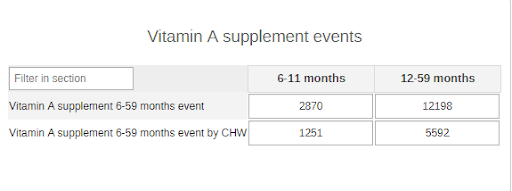

The section, and dataset, collects the information relative to the one-shot (event) distribution activities of Vitamin A and the supplements distributed to children and those distributed by CHWs. As Vitamin A is often distributed at health facilities during campaigns, the two data elements have been specifically designed to separate WHO distributed the supplements: nurses/doctors/pharmacists vs community health workers.

### 4.2.Nutrition Community Dataset

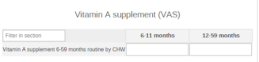

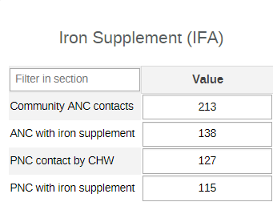

The section focuses on antenatal contacts and new mothers receiving IFA supplements at community level.

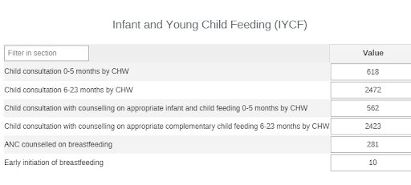

The first table considers children under 24 months visited at community level and the counselling consultations that have been given to their caregivers/mothers.
The second table focuses on the antenatal contacts counselled on breastfeeding during the usual ANC contacts at community level.

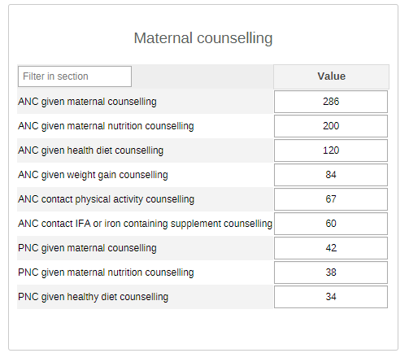

The section focuses on counseling sessions given to mothers on uniquely the health of the mother to be/new mother herself during ANC and PNC in the community.

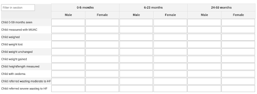

The section groups the routine screening performed on children during nutrition-related consultations (MUAC measurements, height/length and weight measurements) by age groups and sex. It also provides an aggregate overview of children who have lost or gained weight, or whose weight remained unchanged since the last contact. Finally, the section also reports the children with moderate and severe wasting referred for further evaluation and care.

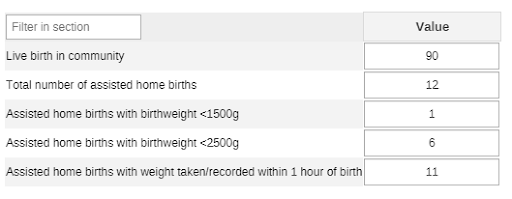

The second part of the section summarizes the births occurring in the community and the weights of the newborns.

### 4.3.Nutrition Facility Dataset

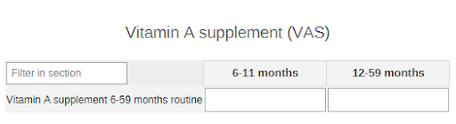

The section collects the information on routine administration of Vit A supplements to U5 children 6-59 months at facility level.

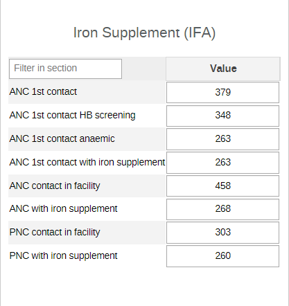

The section collects the data on Hb screenings and anaemia among ANC women, and IFA supplementation during ANC and PNC visits at facility level.

### 4.3.3.Infant and Young Child Feeding (IYCF)

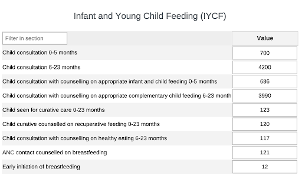

The table considers the children under 24 months visited in the facilities and the counselling consultations that have been given to their caregivers/mothers.
The second table focuses on pregnant mothers counseled on breastfeeding during the usual ANC contacts.

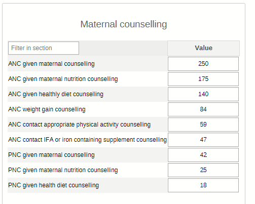

The section focuses on counseling sessions given to mothers on uniquely the health of the mother to be/new mother herself during ANC and PNC at facility level.

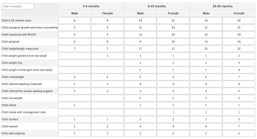

The section gathers all the DEs related to the nutritional screenings (weight fluctuations, MUAC measurements, referrals for moderate and severe wasting, etc) of the children presenting at facility level.

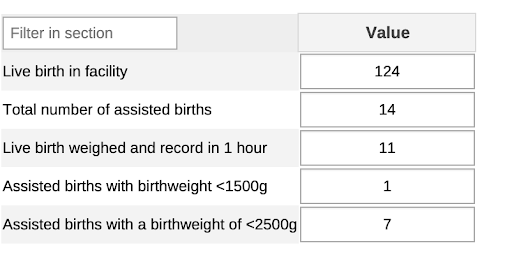

The second part of the section summarizes the births occurring in the facility and the weights of the newborns.

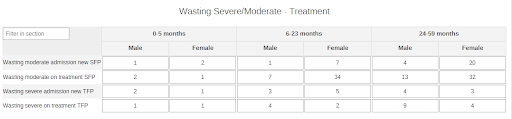

The section collects the information on children with wasting (severe or moderate by age groups and sex) and their admissions to feeding programs.

> **NOTE**
>
> It has not been included in the core configuration for version 1.0.0., but the section could be further disaggregated **by admission criteria** (admission by MUAC and admission by WHZ) if needed.

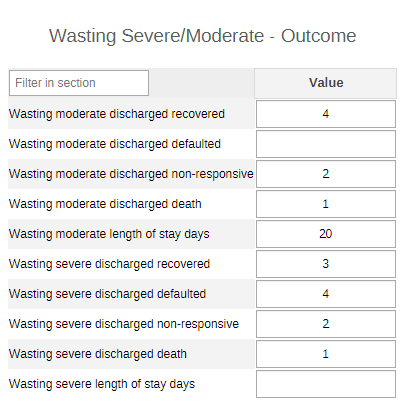

This section reports on referral of children with severe wasting that are referred to a hospital. This referral usually occurs due to medical complications

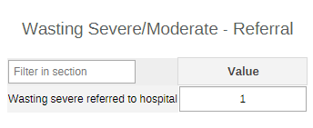

### 4.4.Nutrition Population Dataset

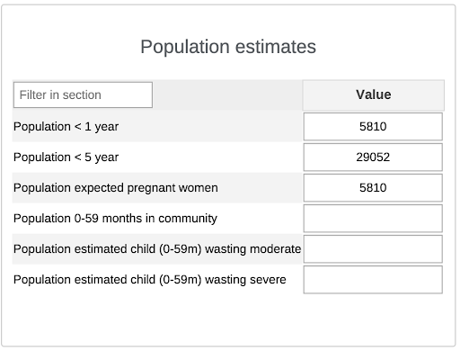

The dataset collects very basic demographic data for the calculation of population-based rates within the NUT activities.
As aforementioned, the source of the denominators and assignation of the dataset to the admin level is very much dependent on the local context and should therefore be kept into consideration during the implementation of the package.

## 5. Validation Rules

Validation rules have also been grouped by activity rather than datasets. All rules have been set with a monthly periodicity. The VR group is called NUT - Nutrition.

| Name        | Left side description     | Operator       | Right side description     |
|----------|------|-------|---------|
| NUT - Community ANC contacts where pregnant women received maternal nutrition counselling Vs Community ANC contacts                                                                                                         | Community ANC contacts where pregnant women received maternal nutrition counselling                                                                         | less_than_or_equal_to | Community ANC contacts                                                                                                  |
| NUT - Child weighed by CHW Vs Child 0-59 months seen by CHW                                                                                                                                                                 | Child weighed by CHW                                                                                                                                        | less_than_or_equal_to | Child 0-59 months seen by CHW                                                                                           |
| NUT - Percentage of first antenatal care contacts during which Hb was tested Vs First antenatal care contacts                                                                                                               | Percentage of first antenatal care contacts during which Hb was tested                                                                                      | less_than_or_equal_to | First antenatal care contacts                                                                                           |
| NUT - Child gained weight measured in health facility Vs Child 0-59 months seen in health facility                                                                                                                          | Child gained weight measured in health facility                                                                                                             | less_than_or_equal_to | Child 0-59 months seen in health facility                                                                               |
| NUT - Consultations for children 6-23 months providing any counselling on appropriate complementary feeding Vs Consultation/child health visit for children 6-23 months                                                     | Consultations for children 6-23 months providing any counselling on appropriate complementary feeding                                                       | less_than_or_equal_to | Consultation/child health visit for children 6-23 months                                                                |
| NUT - PNC contacts during which pregnant women received counselling on healthy diets Vs Postnatal contact - all                                                                                                             | PNC contacts during which pregnant women received counselling on healthy diets                                                                              | less_than_or_equal_to | Postnatal contact - all                                                                                                 |
| NUT - Child weight unchanged by CHW Vs Child 0-59 months seen in community                                                                                                                                                  | Child weight unchanged by CHW                                                                                                                               | less_than_or_equal_to | Child 0-59 months seen in community                                                                                     |
| NUT - Child with height/length measured in health facility Vs Child 0-59 months seen in health facility                                                                                                                     | Child with height/length measured in health facility                                                                                                        | less_than_or_equal_to | Child 0-59 months seen in health facility                                                                               |
| NUT - Child stunted Vs Child 0-59 months seen in health facility                                                                                                                                                            | Child stunted                                                                                                                                               | less_than_or_equal_to | Child 0-59 months seen in health facility                                                                               |
| NUT - Consultations for children 6-23 months providing counselling on complementary feeding with a focus on avoiding consumption of unhealthy foods Vs Consultations/child health visits for children 6-23 months           | Consultations for children 6-23 months providing counselling on complementary feeding with a focus on avoiding consumption of unhealthy foods               | less_than_or_equal_to | Consultations/child health visits for children 6-23 months                                                              |
| NUT - Community postnatal care contacts for which women were given/prescribed postnatal iron containing supplements or reported already receiving the supplements Vs Community postnatal contacts                           | Community postnatal care contacts for which women were given/prescribed postnatal iron containing supplements or reported already receiving the supplements | less_than_or_equal_to | Community postnatal contacts                                                                                            |
| NUT - ANC contacts during which pregnant women received counselling IFA/ iron-containing supplements, including MMS Vs Community ANC contacts                                                                               | ANC contacts during which pregnant women received counselling IFA/ iron-containing supplements, including MMS                                               | less_than_or_equal_to | Community ANC contacts                                                                                                  |
| NUT - Child measured with MUAC Vs Child 0-59 months seen in facility                                                                                                                                                        | Child measured with MUAC                                                                                                                                    | less_than_or_equal_to | Child 0-59 months seen in facility                                                                                      |
| NUT - Child height/length measured by CHW Vs Child 0-59 months seen in community                                                                                                                                            | Child height/length measured by CHW                                                                                                                         | less_than_or_equal_to | Child 0-59 months seen in community                                                                                     |
| NUT - Child with moderate wasting on treatment Vs Child with moderate wasting seen                                                                                                                                          | Child with moderate wasting on treatment                                                                                                                    | less_than_or_equal_to | Child with moderate wasting seen                                                                                        |
| NUT - Child obese with management plan in facility Vs Child obese measured in health facility                                                                                                                               | Child obese with management plan in facility                                                                                                                | less_than_or_equal_to | Child obese measured in health facility                                                                                 |
| NUT - Postnatal care contacts for which women were given/prescribed postnatal iron containing supplements or reported already receiving the supplements Vs Postnatal contacts                                               | Postnatal care contacts for which women were given/prescribed postnatal iron containing supplements or reported already receiving the supplements           | less_than_or_equal_to | Postnatal contacts                                                                                                      |
| NUT - Wasting moderate Length of stay in days Vs Child with moderate wasting on treatment                                                                                                                                   | Wasting moderate Length of stay in days                                                                                                                     | less_than_or_equal_to | Child with moderate wasting on treatment                                                                                |
| NUT - Child with severe wasting child on treatment Vs Child with severe wasting seen                                                                                                                                        | Child with severe wasting child on treatment                                                                                                                | less_than_or_equal_to | Child with severe wasting seen                                                                                          |
| NUT - ANC contacts during which pregnant women received counselling on healthy diet in facility Vs Antenatal contact in facility                                                                                            | ANC contacts during which pregnant women received counselling on healthy diet in facility                                                                   | less_than_or_equal_to | Antenatal contact in facility                                                                                           |
| NUT - Community ANC contacts where pregnant women received counselling on healthy diets Vs Community ANC contacts                                                                                                           | Community ANC contacts where pregnant women received counselling on healthy diets                                                                           | less_than_or_equal_to | Community ANC contacts                                                                                                  |
| NUT - Community ANC contact where pregnant women received any breastfeeding counselling Vs Community ANC contacts                                                                                                           | Community ANC contact where pregnant women received any breastfeeding counselling                                                                           | less_than_or_equal_to | Community ANC contacts                                                                                                  |
| NUT - Child underweight measured in health facility Vs Child 0-59 months seen in health facility                                                                                                                            | Child underweight measured in health facility                                                                                                               | less_than_or_equal_to | Child 0-59 months seen in health facility                                                                               |
| NUT - Sick-child visits for children 0-23 months providing counselling on recuperative feeding during sickness Vs Sick-child visits 0-23 months                                                                             | Sick-child visits for children 0-23 months providing counselling on recuperative feeding during sickness                                                    | less_than_or_equal_to | Sick-child visits 0-23 months                                                                                           |
| NUT - Early initiation of breastfeeding in facility Vs Live birth in facility                                                                                                                                               | Early initiation of breastfeeding in facility                                                                                                               | less_than_or_equal_to | Live birth in facility                                                                                                  |
| NUT - Child referred for moderate wasting to health facility by CHW Vs Child 0-59 months seen in community                                                                                                                  | Child referred for moderate wasting to health facility by CHW                                                                                               | less_than_or_equal_to | Child 0-59 months seen in community                                                                                     |
| NUT - Caregiver/mother of child who received growth promotion counselling in facility Vs Child 0-59 months seen in health facility                                                                                          | Caregiver/mother of child who received growth promotion counselling in facility                                                                             | less_than_or_equal_to | Child 0-59 months seen in health facility                                                                               |
| NUT - ANC contacts during which pregnant women received counselling on weight gain Vs Community ANC contacts                                                                                                                | ANC contacts during which pregnant women received counselling on weight gain                                                                                | less_than_or_equal_to | Community ANC contacts                                                                                                  |
| NUT - First antenatal care contacts where Hb was tested and outcome was anaemic Vs First antenatal care contacts where Hb was tested                                                                                        | First antenatal care contacts where Hb was tested and outcome was anaemic                                                                                   | less_than_or_equal_to | First antenatal care contacts where Hb was tested                                                                       |
| NUT - Child weighed in health facility Vs Child 0-59 months seen in health facility                                                                                                                                         | Child weighed in health facility                                                                                                                            | less_than_or_equal_to | Child 0-59 months seen in health facility                                                                               |
| NUT - Births assisted and weight taken and recorded within 1 hour after birth with value <2500g Vs Births assisted and weight taken and recorded within 1 hour after birth                                                  | Births assisted and weight taken and recorded within 1 hour after birth with value <2500g                                                                   | less_than_or_equal_to | Number of births assisted by a skilled attendant for which weight was taken and recorded within 1 hour after birth      |
| NUT - Antenatal care contacts counselling on IFA or iron-containing supplements, inclusive of MMS in facility Vs Antenatal contact in facility                                                                              | Antenatal care contacts counselling on IFA or iron-containing supplements, inclusive of MMS in facility                                                     | less_than_or_equal_to | Antenatal contact in facility                                                                                           |
| NUT - ANC contacts during which pregnant women received counselling on physical activity in facility Vs Antenatal contact in facility                                                                                       | ANC contacts during which pregnant women received counselling on physical activity in facility                                                              | less_than_or_equal_to | Antenatal contact in facility                                                                                           |
| NUT - Child weight unchanged measured in health facility Vs Child 0-59 months seen in health facility                                                                                                                       | Child weight unchanged measured in health facility                                                                                                          | less_than_or_equal_to | Child 0-59 months seen in health facility                                                                               |
| NUT - Community ANC contacts where pregnant women received maternal counselling Vs Community ANC contacts                                                                                                                   | Community ANC contacts where pregnant women received maternal counselling                                                                                   | less_than_or_equal_to | Community ANC contacts                                                                                                  |
| NUT - Community PNC contacts where postpartum women received maternal counselling Vs Community PNC contacts                                                                                                                 | Community PNC contacts where postpartum women received maternal counselling                                                                                 | less_than_or_equal_to | Community PNC contacts                                                                                                  |
| NUT - ANC contacts during which pregnant women received maternal counselling in facility Vs Antenatal contact in facility                                                                                                   | ANC contacts during which pregnant women received maternal counselling in facility                                                                          | less_than_or_equal_to | Antenatal contact in facility                                                                                           |
| NUT - Consultations with a community health worker for children 6-23 months providing any counselling on appropriate complementary feeding Vs Consultations with a community health worker for children 6-23 months         | Consultations with a community health worker for children 6-23 months providing any counselling on appropriate complementary feeding                        | less_than_or_equal_to | Consultations with a community health worker for children 6-23 months                                                   |
| NUT - ANC contacts during which pregnant women received counselling on weight gain in facility Vs Antenatal contact in facility                                                                                             | ANC contacts during which pregnant women received counselling on weight gain in facility                                                                    | less_than_or_equal_to | Antenatal contact in facility                                                                                           |
| NUT - Home births assisted and weight taken and recorded within 1 hour after birth with value <1500g Vs Home births assisted and weight taken and recorded within 1 hour after birth                                        | Home births assisted and weight taken and recorded within 1 hour after birth with value <1500g                                                              | less_than_or_equal_to | Number of home births assisted by a skilled attendant for which weight was taken and recorded within 1 hour after birth |
| NUT - Child weight lost since last weigh measurement in health facility Vs Child 0-59 months seen in health facility                                                                                                        | Child weight lost since last weigh measurement in health facility                                                                                           | less_than_or_equal_to | Child 0-59 months seen in health facility                                                                               |
| NUT - Child referred for severe wasting in health facility Vs Child 0-59 months seen in health facility                                                                                                                     | Child referred for severe wasting in health facility                                                                                                        | less_than_or_equal_to | Child 0-59 months seen in health facility                                                                               |
| NUT - Receipt of iron containing supplements antenatal care contacts Vs Antenatal care contacts                                                                                                                             | Receipt of iron containing supplements antenatal care contacts                                                                                              | less_than_or_equal_to | Antenatal care contacts                                                                                                 |
| NUT - Antenatal client given IFA or iron containing supplement counselling Vs Antenatal client visit - all                                                                                                                  | Antenatal client given IFA or iron containing supplement counselling                                                                                        | less_than_or_equal_to | Antenatal client visit - all                                                                                            |
| NUT - Child wasted Vs Child 0-59 months seen in health facility                                                                                                                                                             | Child wasted                                                                                                                                                | less_than_or_equal_to | Child 0-59 months seen in health facility                                                                               |
| NUT - Births assisted and weight taken and recorded within 1 hour after birth Vs Total number of assisted births                                                                                                            | Births assisted and weight taken and recorded within 1 hour after birth                                                                                     | less_than_or_equal_to | Total number of assisted births                                                                                         |
| NUT - Consultation for an infant 0-5 months providing any counselling on appropriate infant and young child feeding Vs Consultation for an infant 0-5months such as postnatal care and other services as immunization       | Consultation for an infant 0-5 months providing any counselling on appropriate infant and young child feeding                                               | less_than_or_equal_to | Consultation for an infant 0-5months such as postnatal care and other services as immunization                          |
| NUT - Child with oedema Vs Child 0-59 months seen in health facility                                                                                                                                                        | Child with oedema                                                                                                                                           | less_than_or_equal_to | Child 0-59 months seen in health facility                                                                               |
| NUT - Postnatal consultations providing maternal counselling Vs Postnatal contact - all                                                                                                                                     | Postnatal consultations providing maternal counselling                                                                                                      | less_than_or_equal_to | Postnatal contact - all                                                                                                 |
| NUT - Child referred for moderate wasting in health facility Vs Child 0-59 months seen in health facility                                                                                                                   | Child referred for moderate wasting in health facility                                                                                                      | less_than_or_equal_to | Child 0-59 months seen in health facility                                                                               |
| NUT - Community PNC contacts where postpartum women received maternal nutrition counselling Vs Community PNC contacts                                                                                                       | Community PNC contacts where postpartum women received maternal nutrition counselling                                                                       | less_than_or_equal_to | Community PNC contacts                                                                                                  |
| NUT - Births assisted and weight taken and recorded within 1 hour after birth with value <1500g Vs Births assisted and weight taken and recorded within 1 hour after birth                                                  | Births assisted and weight taken and recorded within 1 hour after birth with value <1500g                                                                   | less_than_or_equal_to | Number of births assisted by a skilled attendant for which weight was taken and recorded within 1 hour after birth      |
| NUT - ANC contacts during which pregnant women received maternal nutrition counselling in facility Vs Antenatal contact in facility                                                                                         | ANC contacts during which pregnant women received maternal nutrition counselling in facility                                                                | less_than_or_equal_to | Antenatal contact in facility                                                                                           |
| NUT - Consultations with a community health worker for an infant 0-5 months providing any counselling on appropriate infant and young child feeding Vs Consultations with a community health worker for an infant 0-5months | Consultations with a community health worker for an infant 0-5 months providing any counselling on appropriate infant and young child feeding               | less_than_or_equal_to | Consultations with a community health worker for an infant 0-5months                                                    |
| NUT - Child referred for severe wasting support to health facility by CHW Vs Child 0-59 months seen by CHW                                                                                                                  | Child referred for severe wasting support to health facility by CHW                                                                                         | less_than_or_equal_to | Child 0-59 months seen by CHW                                                                                           |
| NUT - Community antenatal care contacts for which pregnant women were given/prescribed iron containing supplements Vs Community antenatal care contacts                                                                     | Community antenatal care contacts for which pregnant women were given/prescribed iron containing supplements                                                | less_than_or_equal_to | Community antenatal care contacts                                                                                       |
| NUT - Home births assisted and weight taken and recorded within 1 hour after birth Vs Total number of assisted home births                                                                                                  | Home births assisted and weight taken and recorded within 1 hour after birth                                                                                | less_than_or_equal_to | Total number of assisted home births                                                                                    |
| NUT - Wasting severe Length of stay in days Vs Child with severe wasting child on treatment                                                                                                                                 | Wasting severe Length of stay in days                                                                                                                       | less_than_or_equal_to | Child with severe wasting child on treatment                                                                            |
| NUT - Child weight lost since last weigh by CHW Vs Child 0-59 months seen by CHW                                                                                                                                            | Child weight lost since last weigh by CHW                                                                                                                   | less_than_or_equal_to | Child 0-59 months seen by CHW                                                                                           |
| NUT - Child obese measured in health facility Vs Child 0-59 months seen in health facility                                                                                                                                  | Child obese measured in health facility                                                                                                                     | less_than_or_equal_to | Child 0-59 months seen in health facility                                                                               |
| NUT - Child assessed with MUAC by CHW Vs Child 0-59 months seen in community                                                                                                                                                | Child assessed with MUAC by CHW                                                                                                                             | less_than_or_equal_to | Child 0-59 months seen in community                                                                                     |
| NUT - Early initiation of breastfeeding in community Vs Live birth in community                                                                                                                                             | Early initiation of breastfeeding in community                                                                                                              | less_than_or_equal_to | Live birth in community                                                                                                 |
| NUT - Child weight gained since last weigh by CHW Vs Child 0-59 months seen in community                                                                                                                                    | Child weight gained since last weigh by CHW                                                                                                                 | less_than_or_equal_to | Child 0-59 months seen in community                                                                                     |
| NUT - Home births assisted and weight taken and recorded within 1 hour after birth with value <2500g Vs Home births assisted and weight taken and recorded within 1 hour after birth                                        | Home births assisted and weight taken and recorded within 1 hour after birth with value <2500g                                                              | less_than_or_equal_to | Number of home births assisted by a skilled attendant for which weight was taken and recorded within 1 hour after birth |
| NUT - Community PNC contacts where postpartum women received counselling on healthy diets Vs Community PNC contacts                                                                                                         | Community PNC contacts where postpartum women received counselling on healthy diets                                                                         | less_than_or_equal_to | Community PNC contacts                                                                                                  |
| NUT - Pregnant women who were given/prescribed iron containing supplements during the first antenatal care contacts Vs Estimated pregnant women                                                                             | Pregnant women who were given/prescribed iron containing supplements during the first antenatal care contacts                                               | less_than_or_equal_to | Estimated pregnant women                                                                                                |
| NUT - PNC contacts providing maternal nutrition counselling Vs Postnatal contact - all                                                                                                                                      | PNC contacts providing maternal nutrition counselling                                                                                                       | less_than_or_equal_to | Postnatal contact - all                                                                                                 |
| NUT - ANC contacts during which pregnant women received counselling on physical activity Vs Community ANC contacts                                                                                                          | ANC contacts during which pregnant women received counselling on physical activity                                                                          | less_than_or_equal_to | Community ANC contacts                                                                                                  |
| NUT - ANC contact during which pregnant women received any breastfeeding counselling Vs ANC contacts                                                                                                                        | ANC contact during which pregnant women received any breastfeeding counselling                                                                              | less_than_or_equal_to | ANC contacts                                                                                                            |

## 6. User Groups

As part of the package configuration, user groups have been created to be used to manage sharing settings in the metadata for all the modules. Core metadata that use these sharing settings include mainly the dataSets, dashboard, indicators and data Elements. The 3 user groups created include:

1. **NUT admin** - users in this group will have sharing setting with view/edit access metadata and view only access to data values in dataSets
2. **NUT access** - users in this group will have sharing setting with view only access to metadata and data values in dataSets  
3. **NUT data capture** - users in this group will have sharing setting with view only access to metadata and edit access to data values in dataSets

Whereas it is important to maintain these userGroups while installing this package, feel free to review them inline with any existing userGroups setup or policy in the host instance.

## 7. Analytics and Indicators

Just like the data element groups, the indicators groups are divided by activities rather than by datasets. Moreover, the indicator groups are further divided by **“core”** and **“additional”** to indicate whether the indicators are part of the compulsory set of indicators, or whether the indicators are optional:

- Maternal Counselling
- Vitamin A supplement
- Wasting - Severe/Moderate
- Iron Supplement *(Core)*/Iron Supplement *(Additional)*
- Infant and Young Child Feeding **(Core)**/Infant and Young Child Feeding **(Additional)**
- Growth monitoring and promotion **(Core)**/Growth monitoring and promotion **(Additional)**

|UID     |   Name    |   Numerator Description  |   Denominator Description    |   Indicator group       |
|-----------|--|-------|-----------|-----|
| `a1PhBcRWVxE` | NUT - Counselling on appropriate weight gain during pregnancy during community ANC (%)                            | ANC contacts during which pregnant women received counselling on weight gain                                                                                               | Community ANC contacts                                                                                                                      | NUT - Maternal Counselling                                                          |
| `A406WuUqRlf` | NUT - Early initiation of breastfeeding in facility (%)                                                           | Early initiation of breastfeeding in facility                                                                                                                              | Live birth in facility                                                                                                                      | NUT - Infant and Young Child Feeding (Additional)                                   |
| `a43BVAY2QhF` | NUT - Maternal counselling received during community ANC (%)                                                      | Community ANC contacts where pregnant women received maternal counselling                                                                                                  | Community ANC contacts                                                                                                                      | NUT - Maternal Counselling                                                          |
| `AAAXN5Mas7U` | NUT - IYCF counselling (6-23 months) in facility (%)                                                              | Consultations for children 6-23 months providing any counselling on appropriate complementary feeding                                                                      | Consultation/child health visit for children 6-23 months                                                                                    | NUT - Growth monitoring and promotion (Core)                                        |
| `aDXBHJZZzqJ` | NUT - Vitamin A supplement 12-59 months event                                                                     | Vit A 12-59 months event                                                                                                                                                   | 1                                                                                                                                           | NUT - Vitamin A supplement                                                          |
| `an2DO3fFiOv` | NUT - Counseling on healthy diets during pregnancy during community ANC (%)                                       | Community ANC contacts where pregnant women received counselling on healthy diets                                                                                          | Community ANC contacts                                                                                                                      | NUT - Maternal Counselling                                                          |
| `aW6UxPfDWgl` | NUT - Child weight lost since last weigh by CHW (%)                                                               | Child weight lost since last weigh by CHW                                                                                                                                  | Child 0-59 months seen by CHW                                                                                                               | NUT - Growth monitoring and promotion (Additional)                                  |
| `b1LNbCysl4l` | NUT - Vitamin A coverage 6-59 months event by CHW (%)                                                             | Vitamin A supplement 6-11 months + 12-59 months event by CHW                                                                                                               | Population 6-59 months                                                                                                                      | NUT - Vitamin A supplement                                                          |
| `bi2rysBZC1k` | NUT - Child stunted (%)                                                                                           | Child stunted                                                                                                                                                              | Child 0-59 months seen in health facility                                                                                                   | NUT - Growth monitoring and promotion (Additional)                                  |
| `boAaYRuqU30` | NUT - Child wasted (%)                                                                                            | Child wasted                                                                                                                                                               | Child 0-59 months seen in health facility                                                                                                   | NUT - Growth monitoring and promotion (Additional)                                  |
| `BqJoHCEtt3d` | NUT - Vitamin A coverage 12-59 months event by CHW (%)                                                            | Vitamin A supplement 12-59 months event/campaign by CHW                                                                                                                    | Population 12-59 months                                                                                                                     | NUT - Vitamin A supplement                                                          |
| `bSia0D5Ib8C` | NUT - Child weight unchanged since last weigh by CHW (%)                                                          | Child weight unchanged by CHW                                                                                                                                              | Child 0-59 months seen in community                                                                                                         | NUT - Growth monitoring and promotion (Additional)                                  |
| `C6HupJSegcr` | NUT - Vitamin A supplement 6-11 months routine                                                                    | Vit A 6-11 months routine                                                                                                                                                  | 1                                                                                                                                           | NUT - Vitamin A supplement                                                          |
| `caTJp6dSWnX` | NUT - Child weight unchanged since last weigh (%)                                                                 | Child weight unchanged measured in health facility                                                                                                                         | Child 0-59 months seen in health facility                                                                                                   | NUT - Growth monitoring and promotion (Additional)                                  |
| `caW8f2z646Y` | NUT - IYCF counselling (6-23 months) in community (%)                                                             | Consultations with a community health worker for children 6-23 months providing any counselling on appropriate complementary feeding                                       | Consultations with a community health worker for children 6-23 months                                                                       | NUT - Growth monitoring and promotion (Core)                                        |
| `criGButF8Sz` | NUT - Wasting moderate recovery (%)                                                                               | Child with moderate wasting discharged recovered                                                                                                                           | Moderate wasting treatment outcome (recovered/died/non responsive/defaulted)                                                                | NUT - Wasting - Severe/Moderate                                                     |
| `CUsNCwnOyuu` | NUT - IYCF counselling (0-5months) in community (%)                                                               | Consultations with a community health worker for an infant 0-5 months providing any counselling on appropriate infant and young child feeding                              | Consultations with a community health worker for an infant 0-5months                                                                        | NUT - Growth monitoring and promotion (Core)                                        |
| `cWBhCEiAxDN` | NUT - Counselling on IFA/iron-containing supplements, including MMS received during ANC in facility (%)           | Antenatal care contacts counselling on IFA or iron-containing supplements, inclusive of MMS in facility                                                                    | Antenatal contact in facility                                                                                                               | NUT - Maternal Counselling                                                          |
| `dOGoAK4d1nD` | NUT - Percentage of assisted home births with a birthweight of <2500g                                             | Number of home births assisted by a skilled attendant for which weight was taken and recorded within 1 hour after birth with value <2500g                                  | Number of home births assisted by a skilled attendant for which weight was taken and recorded within 1 hour after birth                     | NUT - Birthweight                                                                   |
| `dQtd1ienupT` | NUT - Percentage of assisted home births with a birthweight of <1500g                                             | Number of home births assisted by a skilled attendant for which weight was taken and recorded within 1 hour after birth with value <1500g                                  | Number of home births assisted by a skilled attendant for which weight was taken and recorded within 1 hour after birth                     | NUT - Birthweight                                                                   |
| `DyenxP4yRYq` | NUT - Maternal counselling received during PNC (%)                                                                | Postnatal consultations providing maternal counselling                                                                                                                     | Postnatal contact in facility                                                                                                               | NUT - Maternal Counselling                                                          |
| `ebVpMsi3QyV` | NUT - Percentage of assisted births with a birthweight in facility                                                | Number of births assisted by a skilled attendant for which weight was taken and recorded within 1 hour after birth                                                         | Total number of assisted births                                                                                                             | NUT - Birthweight                                                                   |
| `EVfWSTFhuwt` | NUT - Vitamin A coverage 6-11 months event by CHW (%)                                                             | Vitamin A supplement 6-11 months event/campaign by CHW                                                                                                                     | Population 6-11 months                                                                                                                      | NUT - Vitamin A supplement                                                          |
| `ezg1hsGETla` | NUT - Vitamin A coverage 12-59 months event (%)                                                                   | Vitamin A supplement 12-59 months event/campaign                                                                                                                           | Population 12-59 months                                                                                                                     | NUT - Vitamin A supplement                                                          |
| `f7UwxK6T3U9` | NUT - Counselling on maternal nutrition received during ANC in facility (%)                                       | ANC contacts during which pregnant women received maternal nutrition counselling in facility                                                                               | Antenatal contact in facility                                                                                                               | NUT - Maternal Counselling                                                          |
| `fC4Q30h3R3l` | NUT - Early initiation of breastfeeding by CHW (%)                                                                | Early initiation of breastfeeding in community                                                                                                                             | Live birth in community                                                                                                                     | NUT - Infant and Young Child Feeding (Additional)                                   |
| `gBsp2qx5mYJ` | NUT - Vitamin A supplement 6-59 months event                                                                      | Vit A 6-59 months event                                                                                                                                                    | 1                                                                                                                                           | NUT - Vitamin A supplement                                                          |
| `GilUKlnDt7N` | NUT - Wasting moderate defaulter (%)                                                                              | Child with moderate wasting discharged defaulted                                                                                                                           | WM Treatment outcome (recovered/died/non responsive/defaulted)                                                                              | NUT - Wasting - Severe/Moderate                                                     |
| `GkfjaCXafva` | NUT - Child height/length measured by CHW (%)                                                                     | Child height/length measured by CHW                                                                                                                                        | Child 0-59 months seen in community                                                                                                         | NUT - Growth monitoring and promotion (Core)                                        |
| `guWqi5YGubx` | NUT - Vitamin A coverage 6-11 months routine per semester by CHW (%)                                              | Vitamin A supplement 6-11 months routine by CHW                                                                                                                            | Population 6-11 months                                                                                                                      | NUT - Vitamin A supplement                                                          |
| `GYVwfVm3Fdy` | NUT - Maternal nutrition counselling received during community PNC (%)                                            | Community PNC contacts where postpartum women received maternal nutrition counselling                                                                                      | Community PNC contacts                                                                                                                      | NUT - Maternal Counselling                                                          |
| `hCJhKcUi3UN` | NUT - Child weight measurement by CHW (%)                                                                         | Child weighed by CHW                                                                                                                                                       | Child 0-59 months seen by CHW                                                                                                               | NUT - Growth monitoring and promotion (Core)                                        |
| `hingXZP0WoI` | NUT - Vitamin A supplement 6-59 months routine                                                                    | Vit A 6-59 months routine                                                                                                                                                  | 1                                                                                                                                           | NUT - Vitamin A supplement                                                          |
| `HkLfxvwnd0f` | NUT - Vitamin A coverage 6-59 months routine per semester (%)                                                     | Vitamin A supplement 6-11 months + 12-59 months routine                                                                                                                    | Population 6-11 months + 12-59 months                                                                                                       | NUT - Vitamin A supplement                                                          |
| `InBYU8HiOTi` | NUT - Maternal counselling received during ANC in facility (%)                                                    | ANC contacts during which pregnant women received maternal counselling in facility                                                                                         | Antenatal contact in facility                                                                                                               | NUT - Maternal Counselling                                                          |
| `j3YwgKFlAwd` | NUT - Vitamin A coverage 6-59 months routine per semester by CHW (%)                                              | Vitamin A supplement 6-11 + 12-59 months routine by CHW                                                                                                                    | Population 6-11 months + 12-59 months                                                                                                       | NUT - Vitamin A supplement                                                          |
| `j9c61tOYDSJ` | NUT - Child referred for wasting severe to health facility by CHW (%)                                             | Child referred for severe wasting support to health facility by CHW                                                                                                        | Child 0-59 months seen by CHW                                                                                                               | NUT - Wasting - Severe/Moderate, NUT - Growth monitoring and promotion (Additional) |
| `jbWx63T2Evt` | NUT - Percentage of assisted births with a birthweight (facility+community)                                       | Number of births assisted by a skilled attendant for which weight was taken and recorded within 1 hour after birth (facility+community)                                    | Total number of assisted births (facility and community)                                                                                    | NUT - Birthweight                                                                   |
| `JUAtateNrJZ` | NUT - Child referred for wasting severe (%)                                                                       | Child referred for severe wasting in health facility                                                                                                                       | Child 0-59 months seen in health facility                                                                                                   | NUT - Wasting - Severe/Moderate, NUT - Growth monitoring and promotion (Additional) |
| `JUUNLdB0IHQ` | NUT - Wasting severe non-responsive (%)                                                                           | Child with severe wasting discharged non responsive                                                                                                                        | Severe wasting treatment outcome (recovered/died/non responsive/defaulted)                                                                  | NUT - Wasting - Severe/Moderate                                                     |
| `KAdPn3mkieM` | NUT - Counselling on healthy diet received during ANC in facility (%)                                             | ANC contacts during which pregnant women received counselling on healthy diet in facility                                                                                  | Antenatal contact in facility                                                                                                               | NUT - Maternal Counselling                                                          |
| `KAzHnxb2Y7r` | NUT - Counselling on physical activity, during community ANC (%)                                                  | ANC contacts during which pregnant women received counselling on physical activity                                                                                         | Community ANC contacts                                                                                                                      | NUT - Maternal Counselling                                                          |
| `KbNljqg4YLz` | NUT - Vitamin A coverage 6-59 months event (%)                                                                    | Vitamin A supplement 6-11 + 12-59 months event                                                                                                                             | Population 6-11 months + 12-59 months                                                                                                       | NUT - Vitamin A supplement                                                          |
| `kmwcKuJb5L7` | NUT - Wasting severe average length of stay                                                                       | Wasting severe Length of stay in days                                                                                                                                      | Child with severe wasting child on treatment                                                                                                | NUT - Wasting - Severe/Moderate                                                     |
| `kXnUGY69FXj` | NUT - Wasting moderate average length of stay                                                                     | Wasting moderate Length of stay in days                                                                                                                                    | Child with moderate wasting on treatment                                                                                                    | NUT - Wasting - Severe/Moderate                                                     |
| `kzLqFPmXV1A` | NUT - Wasting severe recovery (%)                                                                                 | Child with severe wasting discharged recovered                                                                                                                             | Severe wasting treatment outcome (recovered/died/non responsive/defaulted)                                                                  | NUT - Wasting - Severe/Moderate                                                     |
| `kzmjtxpkOo2` | NUT - Sick child counselling in facility (%)                                                                      | Sick-child visits for children 0-23 months providing counselling on recuperative feeding during sickness                                                                   | Sick-child visits 0-23 months                                                                                                               | NUT - Infant and Young Child Feeding (Additional)                                   |
| `l6BuMoDcnjq` | NUT - Child referred for wasting moderate (%)                                                                     | Child referred for moderate wasting in health facility                                                                                                                     | Child 0-59 months seen in health facility                                                                                                   | NUT - Wasting - Severe/Moderate, NUT - Growth monitoring and promotion (Additional) |
| `lfeSbOpwz1C` | NUT - Wasting moderate treatment coverage (%)                                                                     | Child with moderate wasting on treatment                                                                                                                                   | Population estimated child with moderate wasting                                                                                            | NUT - Wasting - Severe/Moderate                                                     |
| `LocbgpnkM8F` | NUT - Child height/length measurement (%)                                                                         | Child with height/length measured in health facility                                                                                                                       | Child 0-59 months seen in health facility                                                                                                   | NUT - Growth monitoring and promotion (Core)                                        |
| `lQOOOtaZOcn` | NUT - Child MUAC measurement (%)                                                                                  | Child measured with MUAC                                                                                                                                                   | Child 0-59 months seen in facility                                                                                                          | NUT - Growth monitoring and promotion (Core)                                        |
| `M79OSsQ3bch` | NUT - Maternal nutrition counselling received during community ANC (%)                                            | Community ANC contacts where pregnant women received maternal nutrition counselling                                                                                        | Community ANC contacts                                                                                                                      | NUT - Maternal Counselling                                                          |
| `MDn0QhZFeqa` | NUT - Wasting severe mortality (%)                                                                                | Child with severe wasting discharged died                                                                                                                                  | Severe wasting treatment outcome (recovered/died/non responsive/defaulted)                                                                  | NUT - Wasting - Severe/Moderate                                                     |
| `n3X3eX6x7V0` | NUT - Child referred for wasting moderate to health facility by CHW (%)                                           | Child referred for moderate wasting to health facility by CHW                                                                                                              | Child 0-59 months seen in community                                                                                                         | NUT - Wasting - Severe/Moderate, NUT - Growth monitoring and promotion (Additional) |
| `NFdE397ZkSU` | NUT - Provision of iron containing supplements during first antenatal care contact (%)                            | Pregnant women who were given/prescribed iron containing supplements during the first antenatal care contacts                                                              | Estimated pregnant women                                                                                                                    | NUT - Iron Supplement (Additional)                                                  |
| `now1ygb4cII` | NUT - Percentage of assisted home births with a birthweight                                                       | Number of home births assisted by a skilled attendant for which weight was taken and recorded within 1 hour after birth                                                    | Total number of assisted home births                                                                                                        | NUT - Birthweight                                                                   |
| `nQMq2Toxyqb` | NUT - Counseling on healthy diets during community PNC (%)                                                        | Community PNC contacts where postpartum women received counselling on healthy diets                                                                                        | Community PNC contacts                                                                                                                      | NUT - Maternal Counselling                                                          |
| `NSKdHpGKJ5J` | NUT - Receipt of postnatal iron containing supplements though postnatal care contacts fac/com (%)                 | Postnatal care contacts (facility and community) for which women were given/prescribed postnatal iron containing supplements or reported already receiving the supplements | Postnatal contacts (facility and community)                                                                                                 | NUT - Iron Supplement (Additional)                                                  |
| `nW7DNug8AE8` | NUT - Child caregiver growth promotion counselling (%)                                                            | Caregiver/mother of child who received growth promotion counselling in facility                                                                                            | Child 0-59 months seen in health facility                                                                                                   | NUT - Growth monitoring and promotion (Additional)                                  |
| `o0asDzVOXQB` | NUT - Wasting severe child on treatment in TFP                                                                    | Child with severe wasting child on treatment                                                                                                                               | Constant of 1                                                                                                                               | NUT - Wasting - Severe/Moderate                                                     |
| `O1TjSffmYnm` | NUT - Hemoglobin testing at first antenatal care contact (%)                                                      | First antenatal care contacts during which Hb was tested                                                                                                                   | First antenatal care contacts                                                                                                               | NUT - Iron Supplement (Additional)                                                  |
| `O97KWRrD1Y4` | NUT - Antenatal counselling about breastfeeding in community (%)                                                  | Community ANC contact where pregnant women received any breastfeeding counselling                                                                                          | Community ANC contacts                                                                                                                      | NUT - Growth monitoring and promotion (Core)                                        |
| `OGNwI0FNixP` | NUT - Wasting moderate non-responsive (%)                                                                         | Child with moderate wasting discharged non-responsive                                                                                                                      | Moderate wasting treatment outcome (recovered/died/non responsive/defaulted)                                                                | NUT - Wasting - Severe/Moderate                                                     |
| `P4oZuKEVXGw` | NUT - Child obese (%)                                                                                             | Child obese measured in health facility                                                                                                                                    | Child 0-59 months seen in health facility                                                                                                   | NUT - Growth monitoring and promotion (Additional)                                  |
| `P71fDGo3TmF` | NUT - Wasting severe treatment coverage (%)                                                                       | Child with severe wasting child on treatment                                                                                                                               | Population estimated child (0-59m) wasting severe                                                                                           | NUT - Wasting - Severe/Moderate                                                     |
| `pLFU1dUB7kL` | NUT - Receipt of iron containing supplements through community antenatal care contacts (%)                        | Community antenatal care contacts for which pregnant women were given/prescribed iron containing supplements                                                               | Community antenatal care contacts                                                                                                           | NUT - Iron Supplement (Core)                                                        |
| `pmnHkRkdLnT` | NUT - Counselling on healthy diet received during PNC (%)                                                         | PNC contacts during which pregnant women received counselling on healthy diets                                                                                             | Postnatal contact in facility                                                                                                               | NUT - Maternal Counselling                                                          |
| `pog2XR5BqGI` | NUT - Counselling about healthy eating 6-23 months (%)                                                            | Consultations for children 6-23 months providing counselling on complementary feeding with a focus on avoiding consumption of unhealthy foods                              | Consultations/child health visits for children 6-23 months                                                                                  | NUT - Infant and Young Child Feeding (Additional)                                   |
| `QdgxuJA1uYS` | NUT - Counselling on IFA/iron-containing supplements, including MMS received during ANC, during community ANC (%) | ANC contacts during which pregnant women received counselling IFA/ iron-containing supplements, including MMS                                                              | Community ANC contacts                                                                                                                      | NUT - Maternal Counselling                                                          |
| `qHytEh7cxxB` | NUT - Counselling on appropriate weight gain during pregnancy in facility (%)                                     | ANC contacts during which pregnant women received counselling on weight gain in facility                                                                                   | Antenatal contact in facility                                                                                                               | NUT - Maternal Counselling                                                          |
| `qlqpMg522ii` | NUT - Vitamin A coverage 6-11 months routine per semester (%)                                                     | Vitamin A supplement 6-11 months routine                                                                                                                                   | Population 6-11 months                                                                                                                      | NUT - Vitamin A supplement                                                          |
| `rex1ZwEtjAc` | NUT - Child underweight (%)                                                                                       | Child underweight measured in health facility                                                                                                                              | Child 0-59 months seen in health facility                                                                                                   | NUT - Growth monitoring and promotion (Additional)                                  |
| `RlAG7HKFD1f` | NUT - Receipt of iron containing supplements through antenatal care contacts in facility (%)                      | Receipt of iron containing supplements antenatal care contacts                                                                                                             | Antenatal care contacts                                                                                                                     | NUT - Iron Supplement (Core)                                                        |
| `RybypZcuir4` | NUT - Vitamin A coverage 12-59 months routine per semester (%)                                                    | Vitamin A supplement 12-59 months routine                                                                                                                                  | Population 12-59 months                                                                                                                     | NUT - Vitamin A supplement                                                          |
| `rYnsqbjI7BG` | NUT - Child weight lost since last weigh (%)                                                                      | Child weight lost since last weigh measurement in health facility                                                                                                          | Child 0-59 months seen in health facility                                                                                                   | NUT - Growth monitoring and promotion (Additional)                                  |
| `scJNdbW6MRB` | NUT - Percentage of assisted births with a birthweight of <1500g                                                  | Number of births assisted by a skilled attendant for which weight was taken and recorded within 1 hour after birth with value <1500g                                       | Number of births assisted by a skilled attendant for which weight was taken and recorded within 1 hour after birth                          | NUT - Birthweight                                                                   |
| `Sg2R7XKLIGY` | NUT - Vitamin A supplement 12-59 months routine                                                                   | Vit A 12-59 months routine                                                                                                                                                 | 1                                                                                                                                           | NUT - Vitamin A supplement                                                          |
| `sjcnq4Km0Zc` | NUT - Receipt of postnatal iron containing supplements through community postnatal care contacts (%)              | Community postnatal care contacts for which women were given/prescribed postnatal iron containing supplements or reported already receiving the supplements                | Community postnatal contacts                                                                                                                | NUT - Iron Supplement (Additional)                                                  |
| `SNenwRg4ZkE` | NUT - Assisted birth with weight taken and recorded within 1 hour after birth (facility+community)                | Births assisted by a skilled attendant for which weight was taken and recorded within 1 hour after birth (facility+community)                                              | 1                                                                                                                                           | NUT - Birthweight                                                                   |
| `SOG30YELUbY` | NUT - Child MUAC measurement by CHW (%)                                                                           | Child assessed with MUAC by CHW                                                                                                                                            | Child 0-59 months seen in community                                                                                                         | NUT - Growth monitoring and promotion (Core)                                        |
| `T07fFZlAvQa` | NUT - Child overweight (%)                                                                                        | Child overweight                                                                                                                                                           | Child 0-59 months seen in facility                                                                                                          | NUT - Growth monitoring and promotion (Additional)                                  |
| `TZ2q4nCD4nd` | NUT - Vitamin A supplement 6-59 months event by CHW                                                               | Vit A 6-59 months event by CHW                                                                                                                                             | 1                                                                                                                                           | NUT - Vitamin A supplement                                                          |
| `uGF5gfys1qS` | NUT - Child with oedema (%)                                                                                       | Child with oedema                                                                                                                                                          | Child 0-59 months seen in health facility                                                                                                   | NUT - Growth monitoring and promotion (Core)                                        |
| `UtbQOWQM0JX` | NUT - Child weight gained since last weigh by CHW (%)                                                             | Child weight gained since last weigh by CHW                                                                                                                                | Child 0-59 months seen in community                                                                                                         | NUT - Growth monitoring and promotion (Additional)                                  |
| `uTjciSBP8Bu` | NUT - Maternal counselling received during community PNC (%)                                                      | Community PNC contacts where postpartum women received maternal counselling                                                                                                | Community PNC contacts                                                                                                                      | NUT - Maternal Counselling                                                          |
| `V28QnoLjRku` | NUT - IYCF counselling (0-5 months) in facility (%)                                                               | Consultation for an infant 0-5 months providing any counselling on appropriate infant and young child feeding                                                              | Consultation for an infant 0-5months such as postnatal care and other services as immunization                                              | NUT - Growth monitoring and promotion (Core)                                        |
| `VDBnoCTBGvF` | NUT - Child weight gained since last weigh (%)                                                                    | Child gained weight measured in health facility                                                                                                                            | Child 0-59 months seen in health facility                                                                                                   | NUT - Growth monitoring and promotion (Additional)                                  |
| `VHrnuU3lYf0` | NUT - Child screened for wasting in facility (%)                                                                  | Child screened for wasting in facility                                                                                                                                     | Child 0-59 months seen in health facility                                                                                                   | NUT - Wasting - Severe/Moderate                                                     |
| `vHUWtOeQfUE` | NUT - Counselling on maternal nutrition received during PNC (%)                                                   | PNC contacts providing maternal nutrition counselling                                                                                                                      | Postnatal contact - all                                                                                                                     | NUT - Maternal Counselling                                                          |
| `viifJ4PGOaE` | NUT - Child weight measurement (%)                                                                                | Child weighed in health facility                                                                                                                                           | Child 0-59 months seen in health facility                                                                                                   | NUT - Growth monitoring and promotion (Core)                                        |
| `viofQxmV0Pl` | NUT - Percentage of assisted births with a birthweight of <2500g (facility+community)                             | Number of births assisted by a skilled attendant for which weight was taken and recorded within 1 hour after birth with value <2500g (facility+community)                  | Number of births assisted by a skilled attendant for which weight was taken and recorded within 1 hour after birth (facility and community) | NUT - Birthweight                                                                   |
| `Vq11n8OdH2t` | NUT - Receipt of postnatal iron containing supplements through postnatal care contacts in facility (%)            | Postnatal care contacts for which women were given/prescribed postnatal iron containing supplements or reported already receiving the supplements                          | Postnatal contacts                                                                                                                          | NUT - Iron Supplement (Additional)                                                  |
| `vZ8mmzz5iYs` | NUT - Child with oedema by CHW(%)                                                                                 | Child with oedema by CHW                                                                                                                                                   | Child 0-59 months seen by CHW                                                                                                               | NUT - Growth monitoring and promotion (Core)                                        |
| `W5MmXdfWYOl` | NUT - Anemic at first antenatal care contact (%)                                                                  | First antenatal care contacts where Hb was tested and outcome was anaemic                                                                                                  | First antenatal care contacts where Hb was tested                                                                                           | NUT - Iron Supplement (Additional)                                                  |
| `wCIaYWs6kX9` | NUT - Assisted births with a birthweight of <1500g (facility+community)                                           | Assisted births with a birthweight of <1500g (facility+community)                                                                                                          | 1                                                                                                                                           | NUT - Birthweight                                                                   |
| `WKYnXbaO79F` | NUT - Counselling on physical activity in facility (%)                                                            | ANC contacts during which pregnant women received counselling on physical activity in facility                                                                             | Antenatal contact in facility                                                                                                               | NUT - Maternal Counselling                                                          |
| `wPCJ11WI2ql` | NUT - Assisted births with a birthweight of <2500g (facility+community)                                           | Assisted births with a birthweight of <2500g (facility+community)                                                                                                          | 1                                                                                                                                           | NUT - Birthweight                                                                   |
| `WpqMZbPlRE8` | NUT - Wasting severe defaulter (%)                                                                                | Child with severe wasting discharged defaulted                                                                                                                             | Severe wasting treatment outcome (recovered/died/non responsive/defaulted)                                                                  | NUT - Wasting - Severe/Moderate                                                     |
| `xNfBXWCY8Ou` | NUT - Antenatal counselling about breastfeeding in facility (%)                                                   | ANC contact during which pregnant women received any breastfeeding counselling                                                                                             | ANC contacts                                                                                                                                | NUT - Growth monitoring and promotion (Core)                                        |
| `XuPjT7ZR5HG` | NUT - Vitamin A supplement 6-59 months routine by CHW                                                             | Vit A 6-59 months routine by CHW                                                                                                                                           | 1                                                                                                                                           | NUT - Vitamin A supplement                                                          |
| `XyfvuHOvsuc` | NUT - Vitamin A coverage 12-59 months routine per semester by CHW (%)                                             | Vitamin A supplement 12-59 months routine by CHW                                                                                                                           | Population 12-59 months                                                                                                                     | NUT - Vitamin A supplement                                                          |
| `yMD3n9mxSx6` | NUT - Receipt of iron containing supplements through antenatal care contacts fac/com (%)                          | Antenatal care contacts (facility and community) where pregnant women were given/prescribed iron containing supplements                                                    | Antenatal client – all visits facility/CHW                                                                                                  | NUT - Iron Supplement (Core)                                                        |
| `ypIKFpCszhF` | NUT - Vitamin A coverage 6-11 months event (%)                                                                    | Vitamin A supplement 6-11 months event                                                                                                                                     | Population 6-11 months                                                                                                                      | NUT - Vitamin A supplement                                                          |
| `yr9BCMuE7nm` | NUT - Vitamin A supplement 6-11 months event                                                                      | Vit A 6-11 months event                                                                                                                                                    | 1                                                                                                                                           | NUT - Vitamin A supplement                                                          |
| `YYEn4mejqHT` | NUT - Percentage of assisted births with a birthweight of <1500g (facility+community)                             | Number of births assisted by a skilled attendant for which weight was taken and recorded within 1 hour after birth with value <1500g (facility+community)                  | Number of births assisted by a skilled attendant for which weight was taken and recorded within 1 hour after birth (facility and community) | NUT - Birthweight                                                                   |
| `Z5KKhWXdzo4` | NUT - Child obese management plan (%)                                                                             | Child obese with management plan in facility                                                                                                                               | Child obese measured in health facility                                                                                                     | NUT - Growth monitoring and promotion (Additional)                                  |
| `zNPnVDtzV8B` | NUT - Wasting severe child admission new in TFP                                                                   | Child with severe wasting new admission in TFP                                                                                                                             | Constant of 1                                                                                                                               | NUT - Wasting - Severe/Moderate                                                     |
| zSPAKqjsyqu | NUT - Child screened for wasting by CHW (%)                                                                       | Child screened for wasting by CHW                                                                                                                                          | Population 0-59 months in community                                                                                                         | NUT - Wasting - Severe/Moderate                                                     |
| `zTO5aniDoIo` | NUT - Percentage of assisted births with a birthweight of <2500g in facility                                      | Number of births assisted by a skilled attendant for which weight was taken and recorded within 1 hour after birth with value <2500g                                       | Number of births assisted by a skilled attendant for which weight was taken and recorded within 1 hour after birth                          | NUT - Birthweight                                                                   |
| `zwtrn1yDlAa` | NUT - Wasting moderate mortality (%)                                                                              | Child with moderate wasting discharged died                                                                                                                                | Moderate wasting treatment outcome (recovered/died/non responsive/defaulted)                                                                | NUT - Wasting - Severe/Moderate                                                     |

## 8. Dashboards

The NUT package includes three predefined dashboard:

1. NUT - Community

2. NUT - Facility

3. NUT - Facility and Community

> **NOTE**
>
> Please note that the dashboards are preconfigured to provide the users a baseline onto which to build the local dashboards. Users >can edit (remove and add) items and their configuration - change the visualization depending on the disaggregations used, change the >time of analysis depending on the chosen periodicity of the datasets, or change the types of graphs just to name a few examples.

### 8.1.Community Dashboard

This dashboard provides an example of a monitoring dashboard for facility-based nutritional activities. Countries should adapt and expand it according to the local changes to the dataset.

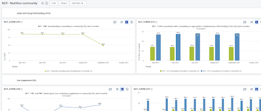

The following table summarizes the items proposed in the dashboard:

| Item name    | Title                                                                                                         | Item type |
|--------------|---------------------------------------------------------------------------------------------------------------|----------|
| NUT_COMM_001 | NUT - Vitamin A 6-59 months routine in community, last semester                                               | maps     |
| NUT_COMM_002 | NUT - Child MUAC, weight and height assessment in community, last 6 months                                    | chart    |
| NUT_COMM_003 | NUT - PNC maternal, nutrition and diet counselling in community, last 6 months                                | chart    |
| NUT_COMM_004 | NUT - ANC maternal, nutrition and diet counselling in community, last 6 months                                | chart    |
| NUT_COMM_005 | NUT - Vitamin A supplement 6-59 months routine by CHW, last 4 semesters                                       | table    |
| NUT_COMM_006 | NUT - Vitamin A 6-59 months event in community, last semester                                                 | maps     |
| NUT_COMM_007 | NUT - ANC and PNC given iron containing supplement in community (%), last quarter                             | chart    |
| NUT_COMM_008 | NUT - PNC and ANC clients given iron containing supplement in community (%), last 6 months                    | chart    |
| NUT_COMM_009 | NUT - ANC breastfeeding counselling in community (%), last 6 months                                           | chart    |
| NUT_COMM_010 | NUT - Child consultation with counselling on appropriate complementary child feeding 6-23m (%), last 6 months | chart    |

### 8.2.Facility Dashboard

This dashboard provides an example of a monitoring dashboard for facility-based nutritional activities. Countries should adapt and expand it according to the local changes to the dataset.

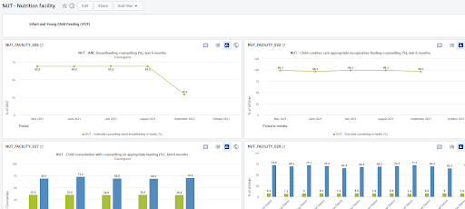

The following table summarizes the items proposed in the dashboard:

| Item name        | Title                                                                                     | Item type |
|------------------|-------------------------------------------------------------------------------------------|----------|
| NUT_FACILITY_001 | NUT - Vitamin A  supplementation Routine & Event per semester - last 2 semesters          | chart    |
| NUT_FACILITY_002 | NUT - Vitamin A supplement Coverage 6-59 months - last 2 semester by event               | chart    |
| NUT_FACILITY_003 | NUT - Receipt of iron containing supplements antenatal care contacts (%) Last 12 months   | chart    |
| NUT_FACILITY_004 | NUT - Antenatal client with iron supplement (%) last 3 months per district                | chart    |
| NUT_FACILITY_005 | NUT - Moderate wasting outcomes (%), last 6 months                                        | chart    |
| NUT_FACILITY_006 | NUT - Wasting - average length of stay by district, last quarter                          | chart    |
| NUT_FACILITY_007 | NUT - Wasting severe: Admissions by Age and Gender - last quarter                         | chart    |
| NUT_FACILITY_008 | NUT - Severe wasting outcomes (%), last 6 months                                          | chart    |
| NUT_FACILITY_009 | NUT - Wasting mortality (%), last 6 months                                                | chart    |
| NUT_FACILITY_010 | NUT - Wasting moderate treatment coverage (%), this year                                  | maps     |
| NUT_FACILITY_011 | NUT - Weight gain, physical activity and IFA counselling, last 6 months                  | chart    |
| NUT_FACILITY_012 | NUT - Vitamin A coverage 6-59 months event, last semester                                | maps     |
| NUT_FACILITY_013 | NUT - Vitamin A coverage 6-59 months routine, last semester                              | chart    |
| NUT_FACILITY_014 | NUT - Vitamin A supplement 6-59 months routine and events, last 4 semesters              | table    |
| NUT_FACILITY_015 | NUT - Vitamin A 6-11 M Supplementation coverage cumulative (semester)                     | chart    |
| NUT_FACILITY_016 | NUT - Child Growth Assessment (%) last 12 months                                          | chart    |
| NUT_FACILITY_017 | NUT - Child  MUAC, weight and height assessment, last 6 months                            | chart    |
| NUT_FACILITY_018 | NUT - PNC maternal, nutrition and diet counselling, last 6 months                        | chart    |
| NUT_FACILITY_019 | NUT - ANC maternal, nutrition and diet counselling, last 6 months                        | chart    |
| NUT_FACILITY_020 | NUT - Vitamin A coverage 6-59 months events, last semester                               | maps     |
| NUT_FACILITY_021 | NUT - Vitamin A cumulative coverage - all age groups                                      | chart    |
| NUT_FACILITY_022 | NUT - Child curative care appropriate recuperative feeding counselling (%), last 6 months | chart    |
| NUT_FACILITY_023 | NUT - Vitamin A coverage 6-59 months event, last semester                                 | maps     |
| NUT_FACILITY_024 | NUT - PNC given iron containing supplement (%), last 6 months                            | chart    |
| NUT_FACILITY_025 | NUT - Hemoglobin testing at first antenatal care contact (%)                              | maps     |
| NUT_FACILITY_026 | NUT - ANC breastfeeding counselling (%), last 6 months                                    | chart    |
| NUT_FACILITY_027 | NUT - Child consultation with counselling on appropriate feeding (%) , last 6  months    | chart    |
| NUT_FACILITY_028 | NUT - Child consultation with counselling on healthy eating 6-23 months (%), this year   | chart    |
| NUT_FACILITY_029 | NUT - First ANC contact - HB/Anaemia/iron supplement, last 6 months                        | chart    |
| NUT_FACILITY_030 | NUT - Wasting severe treatment coverage (%), this year                                    | maps     |

### 8.3. Facility and Community Dashboard

This dashboard is a combination of data coming from facility-based activities and activities carried out in the community. Numbers need of course to be interpreted as totals for the specific activities (contacts) and not by person/client in order not to double count and skew the outcomes of the nutritional activities.

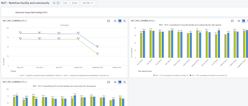

The following table summarizes the items proposed in the dashboard:

| Item name         | Title                                                                                               | Item type |
|-------------------|-----------------------------------------------------------------------------------------------------|----------|
| NUT_FAC_COMM_001 | NUT - Iron supplements for ANC/PNC for facility and community - last 4 quarters                     | chart    |
| NUT_FAC_COMM_002 | NUT - Weight measurement in facility and community, last 6 months                                   | chart    |
| NUT_FAC_COMM_003 | NUT - Height measurement in facility and community, last 6 months                                   | chart    |
| NUT_FAC_COMM_004 | NUT - MAUC measurement in facility and community, last quarter                                      | chart    |
| NUT_FAC_COMM_005 | NUT - ANC given healthy diet counselling in facility and community, last 6 months                   | chart    |
| NUT_FAC_COMM_006 | NUT - ANC given IFA counselling in facility and community, last quarter                             | chart    |
| NUT_FAC_COMM_007 | NUT - ANC given weight gain counselling in facility and community, last 6 months                    | chart    |
| NUT_FAC_COMM_008 | NUT - ANC  physical activity counselling in facility and community, last quarter                    | chart    |
| NUT_FAC_COMM_009 | NUT - ANC maternal counselling in facility and community, last 6 months                             | chart    |
| NUT_FAC_COMM_010 | NUT - Vitamin A  supplement 6-59 months routine and events facility and community, last 4 semesters | table    |
| NUT_FAC_COMM_011 | NUT - ANC all given iron containing supplement in facility and community (%), last 6 months         | chart    |
| NUT_FAC_COMM_012 | NUT - PNC all given iron containing supplement in facility and community (%), last quarter          | chart    |
| NUT_FAC_COMM_013 | NUT - IYCF counselling 6-23 months facility and community (%), last quarter                         | chart    |
| NUT_FAC_COMM_014 | NUT - IYCF counselling 0-5 months facility and community (%), last quarter                          | chart    |
| NUT_FAC_COMM_015 | NUT - ANC  breastfeeding counselling community and facility (%), last 6 months                      | chart    |
| NUT_FAC_COMM_016 | NUT - ANC maternal nutrition counselling in facility and community, last quarter                    | chart    |

## 9.Special Considerations: Nutrition and Community

The need to align the efforts to enhance community programmes and their data is one of the paramount priorities for the effective analysis of community needs and activities.
While the Community dataset of the NUT package supports the collection of nutrition-related data at community level, the DHIS2 **Community Health Information Systems (CHIS)** { #chis-system-design } metadata package is also designed to facilitate the capture and analysis of a core set of indicators for community-based health services. The CHIS metadata package developed in collaboration with UNICEF accompanies the  WHO Analysis and Use of Community Data: Guidance for community health service monitoring.
Among the range of health areas covered in the modules of the CHIS package, **Nutrition information** { #ch-nut-aggregate-design } can be collected at monthly and yearly intervals.

Should users have **both the NUT and the CHIS packages** in the same instance, they can use the table to compare the two packages and observe the parallelisms and the differences in order to select the dataset that better mirrors the local activities.

The [NUT/CHIS summary table](resources/nut-chis-mapping.xlsx)  provides an overview of the alignment of the DEs present in the NUT - Community and in the CHIS - Nutrition datasets.

The following sections and DEs **in the NUT package have no direct overlap with the CHIS - Nutrition** dataset:

|  Section      |     DEs - Form name    |
|----------|-----------|
| Maternal counselling                  | ANC given maternal counselling ANC given maternal nutrition counselling in community ANC given health diet counselling ANC given weight gain counselling ANC given physical activity counselling ANC given IFA or iron containing supplement counselling PNC given maternal counselling PNC given maternal nutrition counselling PNC given healthy diet counselling |
| Infant and Young Child Feeding (IYCF) | PNC contacts - all                                                                                                                                                                                                                                                                                                                                                  |
| Growth monitoring and promotion       | Child weight lost Child weight unchanged Child gained weight Child referred for moderate wasting support to health facility by CHW                                                                                                                                                                                                                                  |

Some of the CHIS sections and DEs also do not directly overlap with any of the DEs in the NUT - Community dataset:

| Data set |  Section   |     DEs - Form name   |
|-------|--------------|-------|
| Monthly | Breastfeeding and birth weight         | Newborns delivered in the community and put to breast within the first hour of birth Newborns with documented birth weight Newborns with low birth weight delivered                                                       |
| Monthly | Deworming                              | People targeted for deworming preventive chemotherapy People receiving deworming preventive chemotherapy People receiving deworming preventive chemotherapy                                                               |
| Monthly | Vitamin A supplementation - events     | Children (6-59m) attending Vit A event in semester 1 Children (6-59m) given Vit A by CHW in semester 1 event Children (6-59m) attending Vit A event in semester 2 Children (6-59m) given Vit A by CHW in semester 2 event |
| Monthly | Severe Acute Malnutrition (SAM)        | Children (6-59m) assessed for SAM Children (6-59m) with SAM                                                                                                                                                               |
| Monthly | Wasting                                | Children (6-59m) in the community                                                                                                                                                                                         |
| Monthly | Diarrhoea                              | Children aged 0-9 years presenting with diarrhoea who received treatment Children (0-9 y) treated for diarrhoea                                                                                                           |
| Yearly  | Body weight                            | Children (5-19 y) overweight and obese                                                                                                                                                                                    |
| Yearly  | Overweight (0-4 y)                     | Children (0-4 y) overweight                                                                                                                                                                                               |
| Yearly  | Obesity (5-19 y)                       | Children (5-19 y) overweight and obese                                                                                                                                                                                    |
| Yearly  | Underweight women and adolescent girls | Consultations non-pregnant women and adolescent girls Underweight women                                                                                                                                                   |

### 9.1.Data Triangulation Facility and Community

Should the users decide to collect the community data on nutrition with the CHIS - Nutrition dataset while using the NUT - Facility dataset for the health facility data, they will have to adapt the dashboard triangulating the community and the health facility nutrition data (NUT - Nutrition facility and community)
The table below provides the CHIS indicators, if present, that can be used to replace the NUT indicators referring to community activities.

|  Graph/Table title   |     NUT indicator  |    CHIS indicator  |
|-------------------------|-----------|-----------|
| NUT - ANC breastfeeding counselling community and facility (%), last 6 months                      | NUT - Antenatal client breastfeeding counselling in community (%)                                         | CH036 - ANC visits with breastfeeding counselling (%)                                                                                                                                                                                               |
| NUT - IYCF counselling 0-5 months facility and community (%), last quarter                         | NUT - IYCF counselling 0-5 months in community (%)                                                        | CH058 - Consultations for children (0-5 m) with feeding counselling (%)                                                                                                                                                                             |
| UT - IYCF counselling 6-23 months facility and community (%), last quarter                         | NUT - IYCF counselling 6-23 months in community (%)                                                       | CH059 - Consultations for children (6-23 m) with feeding counselling (%)                                                                                                                                                                            |
| NUT - ANC all given iron containing supplement in facility and community (%), last 6 months        | NUT - Antenatal contact given iron containing supplement in community (%)                                 | CH037 - Women given/prescribed iron supplements during ANC (%)                                                                                                                                                                                      |
| NUT - PNC all given iron containing supplement in facility and community (%), last quarter         | NUT - Postnatal contact all visits given iron containing supplement in community (%)                      | There is no direct correspondence to a CHIS indicator for PNC iron supplementation in the Nutrition module.                                                                                                                                         |
| NUT - Vitamin A supplement 6-59 months routine and events facility and community, last 4 semesters | NUT - Vitamin A supplement 6-59 months routine by CHW NUT - Vitamin A supplement 6-59 months event by CHW | CH061b - Children (6-59m) given Vit A each semester event(%)  This is the only predefined indicator for the Vit A supplementation. The dataset contains all the necessary DEs to build two CHIS indicators overhauling with the two NUT indicators. |
| Maternal counselling section of the dashboard                                                      | NUT - Antenatal contacts given maternal nutrition counselling in community (%)                            | There is no direct correspondence to CHIS indicators for purely maternal counselling activities in the Nutrition module.                                                                                                                            |
| NUT - Height measurement in facility and community, last 6 months                                  | NUT - Child height/length for age measurement in community (%)                                            | CH067 - Children (0-4 y) with measured height (%)                                                                                                                                                                                                   |
| NUT - Weight measurement in facility and community, last 6 months                                  | NUT - Child weighed measurement in community(%)                                                           | CH064 - Children (6-59 m) weighed  There is no proportion preconfigured in the CHIS-Nutrition dataset but can be configured by cloning indicator CH064 and setting DE CH067b as denominator.                                                        |
| NUT - MUAC measurement in facility and community, last quarter                                     | NUT - Child MUAC measurement in community (%)                                                             | There is no direct correspondence to CHIS indicators for MUAC-only indicators - more info in the tables in section 9.                                                                                                                               |

## 10. Android Compatibility

Digital data packages are optimized for Android data collection with the [**DHIS2 Capture App**](https://play.google.com/store/apps/details?id=com.dhis2&hl=en), free to download on the GooglePlay store.  Key considerations in design was to ensure that all forms are configured with sections that structure form layout for better display on the android devices.  Also, with the requirement of minimal data disaggregation in this package, all the dataSet layout should provide a concise view for Android display.

## 11. References

UNICEF (November 2021). Strengthening Nutrition Information Systems URL: https://data.unicef.org/resources/strengthening-nutrition-information-systems/ Guidelines and links will be available soon.
